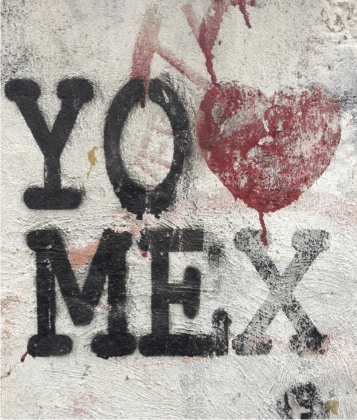

## Civic Engagement and Collaboration
*William Strong*
 
 
 
### How can we work collaboratively to influence and change the civic design of our communities, cities and public space?
This was the question posed to citizens in Mexico City and Dundee. Digital Futures UKMX, an initiative proposed by the V&A Digital Programmes and the British Council, invited artists, designers, technologists, engineers and makers on both sides of the Atlantic to work together, share ideas and design open, globally relevant tools for the future. Today, around 54% of the world’s population live in cities and this figure is expected to grow by an estimated 1.84% for the next five years[1](#fn1)<a id="fnref1"/>. Now more than ever, it is crucial that members of the world’s cities have the capacity to evaluate their environment and the resources and support to develop meaningful solutions that can be shared across the world.

### The Creative Economy team
The role of Creative Economy team at British Council is to connect people to answer the bigger questions that will affect the cultural sector and creative industries. The department supports a network of pioneers and innovators from a variety of backgrounds such as artists, academics and industry leaders to explore the meeting points between culture, technology and business. We support a global network of co-working, hub spaces and an ongoing programme of hacks and labs bringing businesses, creative technologists, designers and developers together to create solutions to social issues.  

## Designing solutions through prototyping labs and hacks

“In the cultural sector, hacks, hackdays and hackathons are events that seek to develop new relationships and collaborations, whilst creating solutions and unravelling challenges[2](#fn2)<a id="fnref2"/>,”  they provide a safe testing ground to try out radically new ideas; participants can grow a prototype from an idea into physical or digital form, learn from their mistakes and are able to meet others in a supportive and discursive community. It is these low-risk environments that give creative technologists the space both mentally and physically to create solutions to real problems and questions.
Digital Futures UKMX was a series of labs that invited participants to prototype solutions to issues such as the environment, climate change, e-waste and sustainability. The key aim of this project was to connect the digital and creative communities from environments half way around the world to devise solutions relevant in both places. Expanding the dialogue in this way meant that we could learn from each other, while proposing globally relevant products and prototypes.

### Mexico City and Dundee; linked
We are connected via an expansive digital network, allowing us the opportunity to exchange content and ideas which form the crucial basis for innovation. Labs in both countries were connected at points via web link ups, meaning citizens could share ideas and information as they were happening; keeping the immediacy and vibrancy that allows ideas to develop organically, sometimes lost when working remotely.

Between the 19th and 21st June 2015 participants in both countries gathered information from their cities, this preceded an intense 48 hour prototyping marathon and culminated in 15 products and prototypes currently being developed at time of print. In Mexico City over 50 people met at Laboratorio para la Ciudad (the Laboratory for the City), to go on a walking tour of the city. Led by Creative Dundee, the same happened in Scotland. Both tours offered a unique view of the city, allowing participants to draw on the fabric of both locations.

Around 200 people signed up for the 48 hour prototyping marathon at Centro de Cultura Digital, citizens from a diverse range of disciplines came together to start designing sharing tools to be used between the two countries. The appetite for events such as this was clear on both side of the Atlantic; 12 working prototypes were presented at Centro de Cultura Digital and six coming from Dundee.

### What can these two cities learn from one another?
Mexico City is home to around 22 million people, it is the largest Spanish-speaking city in the world; Dundee by contrast is home to around 150,000[3](#fn3)<a id="fnref3"/>. Why then have these two environments apparently so different been linked? What can such a big city learn from a small one? While each place faces challenges specific to its size, expansion and geographic location, there were striking similarities identified making them ideal partners to inspire and learn from one another:
Dundee was recently named as City of Design by UNSECO “recognised … for its diverse contributions to fields including medical research, comics and video games[4](#fn4)<a id="fnref4"/>”, it is the first city in the United Kingdom to receive this accolade. Dundee has an engaged and established community of creative people and collectives. It is famous for its contribution to the arts, technology and medicine among other fields. It has two Universities with world-leading roles in the video games industry among many others and the V&A will open there in 2017; it is a centre for innovation in design. This wealth of talent and expertise made Dundee an ideal UK hub to twin with the culturally rich and diverse setting of Mexico City.

### Working together for a collective, digital future
It was clear from the prototypes produced and conversations taking place that the relative size difference between Mexico City and Dundee was not a hindrance. Participants were keen to connect with each other to exchange aspects from both countries and remix elements of British and Mexican Culture. Connected digitally over the web the groups were able to interact with each other live, harnessing their enthusiasm and energy to form a bridge across the Atlantic. Participants produced solutions to navigate our experience of the built environment, both physically and mentally, in a playful, engaging and considered way.

At its core, Digital Futures UKMX is about connecting people. It is an illustration that for inspiration and innovation we mustn’t forget or overlook the creative value of the individual within the testing ground of the lab. It is clear that with the right environment, networks and enthusiasm, the innovative potential from collaboration can be achieved in the long term. Civically minded citizens need the space to test concepts, speak about their work critically and crucially, be able to make mistakes when designing solutions for the future. These pioneers, able to turn an idea into a physical or digital product or object, form a vital role within the Creative Economy globally. Digital Futures UKMX is part of the UKMX2015 season of culture celebrating the cultures of the UK and Mexico; British Council is proud to have supported this project as both an important learning tool between the two countries and a means to drive forward urban innovation from the civically minded.

---

<ol>
<li id="fn1"><a href="http://www.who.int/gho/urban_health/situation_trends/urban_population_growth_text/en/"</a> <a href="#fnref1">↩</a></li>
<li id="fn2"><a href="http://futureeverything.org/wp-content/uploads/2014/10/BC-New-Playgrounds.pdf"</a> <a href="#fnref2">↩</a></li>
<li id="fn3"><a href="http://www.dundeecity.gov.uk/sites/default/files/publications/Dundee%20Economic%20Profile%20March%202014.pdf"</a> <a href="#fnref3">↩</a></li>
<li id="fn4"><a href="http://www.dundeecity.gov.uk/unesco"</a> <a href="#fnref4">↩</a></li>
</ol>
