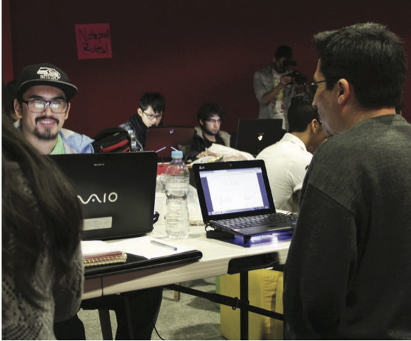

<nav aria-label="...">
  <ul class="pager">
    <li class="previous"><a href="02.html">&larr; Previous</a></li>
    <li class="next"><a href="04.html">Next &rarr;</a></li>
  </ul>
</nav>

---

## Coding Mexico
*Miguel Angel Angeles*

Mexico is a country pursuing questions. In the global code that integrates a long series of variables that act both as ladders and fences of a never ending puzzle, the pieces we have are quite exposed. With a growing population that made possible our inclusion in the MINT group – economist Jim O’Neill’s ultimate attempt to encapsulate and understand the impact of markets like Nigeria, Indonesia, ourselves and Turkey – Mexico also faces disturbing levels of inequality in the distribution of wealth. The 14th largest economy in the world – <a href="http://tinyurl.com/pk2gq32">according to Forbes</a> – and homeland of the omnipresent Carlos Slim still has 45 million people living in poverty, according to a recent study by Gerardo Esquivel published by Oxfam.[1](#fn1)<a id="fnref1"/>

Violence is also a major issue. Ayotzinapa, Tlatlaya, Apatzingán and Ostula can explain quite sufficiently what’s going on in the country. In addition, the alarming number of journalists being killed and the rate of feminicides have played a part in the Mexican political crisis of the last three years. Crisis that involves not only the government but also the military and of course, the narco effect. Crisis that on the other hand, is unable to change key elements that may lead us to a better future. Because being an affected and injured nation does not mean that creativity and collaboration are over. This multi-coloured algorithm called Mexico is more a promise than a sentence. History has shown us that when struggles involve and include uncommon and dynamic players and inserts them into creativity paths, things can improve in a positive way. Name it Cape Town, name it Turin. Name it Dundee.

We are entering an era where workforce will act as a factor that determines growth and also the new concepts that surround it. Those that will be able to join the conversation – and make it more inclusive – of who we are, what is culture, how we create and consume benefit, how we relate ourselves to our environment, how we produce and of course, how we deal with what’s left, are those embracing new ways to talk, whether it is through a video game that evidences and proposes answers to any given conflict or programming a radar, a 3D printer or prototyping what could become the next digital fascination on the horizon. There’s no limit and no format. In the most dynamic era in terms of knowledge – sharing the goal is to play together: no matter if it’s done from a laptop at a teenager’s home or through a happily frantic marathon that joins the talents of two countries in one big auditorium in Mexico City. It’s all about the creative assets and the will to make of this present code, a prime venture able to change the perspective and the effects of what we consider design. We are designing Mexico and it’s open-source. Feel very welcome.

---

<ol>
<li id="fn1"><a href="http://tinyurl.com/nqv7jrc">Desigualdad Extrema en México: Concentración del Poder Económico y Político</a> <a href="#fnref1">↩</a></li>
</ol>

---

<nav aria-label="...">
  <ul class="pager">
    <li class="previous"><a href="02.html">&larr; Previous</a></li>
    <li class="next"><a href="04.html">Next &rarr;</a></li>
  </ul>
</nav>
