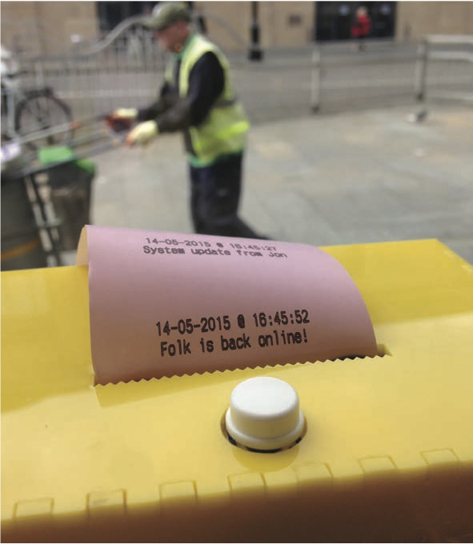

<nav aria-label="...">
  <ul class="pager">
    <li class="previous"><a href="09.html">&larr; Previous</a></li>
    <li class="next"><a href="11.html">Next &rarr;</a></li>
  </ul>
</nav>

---

## A Sense Of ‘me’ On The Connected High Street
*TapWriters*
 
 
 
The High Street. What a familiar term. If you’re British it raises many different thoughts – from memories of teenage dreams to boarded streets paved with pound-shops as the brands have long left for ‘out of town shopping’. For some this highly British definition of the main retail district, is perhaps a social barometer of Britain as a whole. That somehow the demise of the high street represents something bigger, scarier and altogether rather depressing. Yet is this the case? What if the High Street has just shifted, not to ring road warehouses, but to the smaller streets just off the main street, forming something as much as a place to go to shop as it ever was? That it is exciting, or possibly more exciting than it has been in the history of centralised retail...

With such changes a-foot, we wanted to view our High Street through a different lens. A very different lens from a country that formed part of the largest ‘high street’ in history – the 4,000 mile silk route that had India in it’s prime position.

As part of the Unbox Festival 2014 we went to New Delhi to find out more about what a main retail place is and how alternative economies to ours operate. Prasad Shetty and Rupali Gupte, from the Bangalore architectural collective CRIT, took us on a walking ‘tour’ of 1980s urban retail district, Nehru Place that ‘seems to be configured through a complex interplay of messy claims, shrewd enterprises and absurd obsessions.’ It was an incredible location and very hard to describe. Perhaps if Ridley Scott created a shopping experience for ten thousand people from concrete 1980s building blocks you might be somewhere close. Primarily a technology retail area, each shop occupying a three meter cubed space selling just one type of hardware – one cube might be hard drives, another mobile phone screens, another batteries. But most startlingly Nehru Place is brought to life as an interconnection of things by a complex human network of pavement gofers who hook up products and services for a buyer from across the vast array of cube shops as fits their needs. And in the middle of all of this we met the artist Gagan who decided to locate his studio in the middle of a twenty story high concrete slab. To fund his practice he did something really rather remarkable. By observing that the communications in this urban cubic ‘mess’ were difficult – (mobile phone signals failed to penetrate the buildings and WiFi networks could not cope with the density of demand) – he created his own traditional landline phone network and signed people up. He now has over 1500 traders using his GaganNet – a 4 digit dial up landline, charging a small fee (200 Rupees a month) that allows him to produce the art he wants. It’s a remarkably simple solution to connectivity when traditional digital solutions don’t work. It reminded us of the importance of networks and how people need to be connected – and that it doesn’t have to be through a touchscreen or keyboard.

This thinking is the kind of thinking that the Internet of Things surely needs? The rather depressing thing at the moment is that if you do an image search for ‘Internet Of Things’ you are faced with pages of thumbnails of corporate diagrams about the size of the market, the potential, the promise and the technology. What do you don’t get is any ‘things’. It would be very easy to make the mistake that the Internet of Things is a corporate spoof – sold to us through illustrated diagrams of keys, buses, light bulbs, the globe, houses, planes, plants, radios, televisions and even an ironing board... There is, as our good friend at the Met Office Mike Saunby is quick to point out, – ‘nothing new there’. It is all about retrofitting new technology to existing products. Something that didn’t happen when paradigm-shifting technologies such as television, radio, printing and the axel arrived. This sets out a grand challenge of what entirely new things can, and should, be designed that harness the internet in physical objects without screens.

Uniting the experience of the high street, or Chowk from India with the challenge from Michael Saunby of creating entirely new designs that harness IoT, we explored the idea of creating a physical social-network for a group of independent shops/cafes in Dundee – which we’re thinking of as a tiny social-network – possibly the world’s smallest!

It’s a network of small till-roll printers that are connected to the web, powered by the amazing Electric Imp. We’re calling them TapWriters. Because you tap at a screen and it comes out on paper – on all of the rolls at the same time. It’s changing a printer from a printing appliance into a social media device – paper is the media rather than Facebook’s or Twitter’s screen. This limits resources (Katy Perry and Ronaldo would run out of paper pretty quickly...). We’ve created a social feedback mechanism by having a single button that you tap as a form of ‘receipt’ – a deliberately ambiguous interaction that is neither a ‘like’ nor a ‘thumbs up/down’. It’s simply a response that is printed across the small network. We’ve installed eight in small shops, cafes and a yoga centre in Dundee. And we’re watching to see what happens.

So how does it work? Mike’s been playing with the till rolls connecting to Imp using code from Instructables. An amazingly powerful feature of Imp is that it handles Http messaging and is super straightforward to have all of the printers connected in a network. So this is great technically. Yet the thing that got us most excited is the scalability that Imp provides. With so few components in the TapWriters and the cost and scalable tools Imp has for mass production, we’re almost ready to go live with a product...a physical social network that connects people through paper.

But in designing networks are we missing something? Are we missing a sense of ‘me’? In the high street are the big brands also forgetting this? Perhaps that’s why so many of us are reaching for smaller independent shops and cafes for crafted personal experiences? The high street is far more than a place to buy stuff. After all it’s those teenage moments of trying on the clothes of our alternate future selves, buying music, queuing for cinemas, sitting on the town square and eating fast food on plastic trays, that we all experimented with to find out both how to be social and who we as individuals wanted to become. It’s not big data we want from IoT it’s personal experiences.

With this in mind, we’re interested in how IoT in our shops could do something intrinsically more human for individuals. At the optical boutique, Spex Pistols, in Dundee, we’re working with owner, Richard, to build atypical personal experiences for his customers and visitors. Two things you should know about Richard: fact 1 he is a massive Smiths fan and his shop is full of music memorabilia; fact 2 he loves capturing curated photos of his customers in his shop. His is somewhere to go when you want to find beautiful glasses, both vintage and contemporary, that are not boring. Richard associates music, personas, eras and icons with most pairs and has filled his shop with the music and iconography to match.

In response to this, one piece that’s in early prototype stages is exploring who we are, and who we become, when we look in the mirror and when we try different glasses on. It is a piece that only functions when someone is alone in the shop (and Richard is upstairs in his mezzanine workshop, as is often the case) and is somewhere between a magical fairytale mirror and
a photoautomat, that uses cloud-based photo-interpretation software to guess your age, mood and facial expression in order to select music from your teenage years. Without explicitly telling you your age, the intention is to allow people to be both prompted back to another era and also play with different personas through wearing different glasses.

We want to explore what happens when the IoT creates private, human, playful, experiences that re-engage with a time when the high street might have been one of the most formative places in your life. A place that wasn’t networked, but was certainly incredibly connected and social. Which leaves us now with a tension in designing for the connected high street. Are we looking for IoT that creates completely new forms of social connection? Or are we looking to understand ourselves more? To remain anonymous if we want, but also to connect us to the things we might want or need in ways that we hadn’t imagined? A lot of questions, without many answers. Which makes this an exciting time to research what we want from technology and how it fits with our lives in the messy business of being human.

*Project Team: Jon Rogers, Michael Shorter, Chris Speed, Jayne Wallace*

---

<nav aria-label="...">
  <ul class="pager">
    <li class="previous"><a href="09.html">&larr; Previous</a></li>
    <li class="next"><a href="11.html">Next &rarr;</a></li>
  </ul>
</nav>
