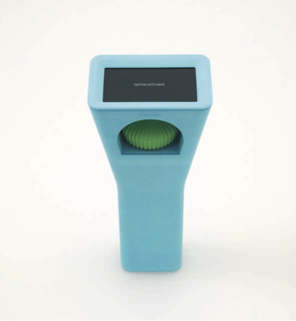

## Datacatcher Walking Tour
**
 
 
 
The Datacatcher is a mobile device with a screen on one end and a large control dial set in a recess underneath. Short statements, derived from public and private datasets such as the census and credit agency data appear on the screen every few seconds, addressing topics including average house prices in the surrounding area, typical income, the number of pubs or of GP surgeries. Turning the dial one way scrolls through all the messages that have appeared on the device; turning it the other way accesses a set of poll questions about the area that can be answered using the dial to select among alternatives.

We designed the Datacatcher to give a sense of the sociopolitical texture of the neighbourhoods where it is used. But the Datacatcher can be viewed from multiple orientations. For instance, our initial motivation was to support an expanded view of environmental issues by linking them to related concerns. It is also relevant to current activities aimed at making data more transparent and empowering – indeed, during an early test, one participant commented that it offers ‘Big Data for little people’. The Datacatcher is part of a research project funded by the European Research Council to investigate new ways to live with digital technologies- and new ways of living that digital technologies can support. To understand the multiple points of view the Datacatcher would afford, we manufactured 130 prototypes and distributed them to people in the Greater London area, who used them for up to two months. We hired two documentary filmmaking teams to capture these experiences, and their work can be viewed on our <a href="http://vimeo.com/channels/datacatcher">Vimeo channel</a>.

It is the participants’ voices that complete the story of what we have made. This is not a simple and unitary narrative, however; each one has their own version to tell, and the experiences they describe vary so widely they might be describing different devices. Rather than producing a clear account then, the voices mingle and weave to create a kind of polyphonic, fragmentary story of the Datacatcher – one that will resonate through our future research and practice. The Interaction Research Studio in the Design Department at Goldsmiths explores the design of computational systems for everyday life. Our practice-based research integrates design-led research methods with work on embedded and ubiquitous technologies to produce prototype products embodying new concepts for interaction. We don’t pursue design as problem solving, but instead design products to create situations that encourage playfulness, exploration and insight.

Because our prototypes are evocative and open ended, a crucial part of our process involves asking volunteers to live with our designs to see how their experiences evolve. The outcomes of our work include articles and exhibitions that expose our philosophies, methods and empirical work to academic, industrial and general publics.

*The Datacatcher team at the Interaction Research Studio: Andy Boucher, Dave Cameron, Bill Gaver, Mark Hauenstein, Nadine Jarvis, Jen Molinera, Liliana Ovalle, Sarah Pennington.*
