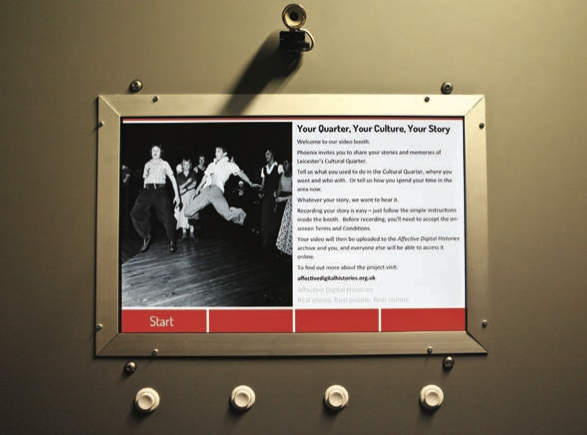

## Recreating De-Industrialised Places, 1970s – Present
*Affective Digital Histories*
 
 
 
Affective Digital Histories: Recreating De-Industrialised Places, 1970s – Present was a research project led by the University of Leicester that set out to explore the untold stories of people who lived and worked in former industrial buildings at two locations: Leicester’s Cultural Quarter and Glossop, a mill town in North Derbyshire.

The decline of British manufacturing during the 20th Century has been well documented. Many of the buildings and spaces that were built for industry still exist today, converted to museums, galleries, cafes and apartments, with varying degrees of connection to their original purpose. Much of this has come about in the past two decades through a process of commercial and government driven regeneration.

What’s less well documented is the role these places played in the lives of communities and individuals before the regeneration boom of the 2000s kicked in. How were de-industrialised spaces reoccupied and reused? How did this change over time? And what effect did this have on the people who used them? It’s this social heritage that Affective Digital Histories was chiefly concerned with.

A really broad partnership of different individuals and organisations came together to try and find answers to these questions: academics and researchers worked alongside artists, curators and technologists – developing new approaches to engaging the public in this research using art, culture and new technologies.

In Leicester, what’s now the city’s Cultural Quarter was once home to a thriving hosiery industry, and whilst remnants of this industry remain in the area to this day, it had mostly succumbed to a long process of decline by the late 1970s. During the 1980s the area became home to the city’s underground music scene, with Northern Soul all-nighters, Hip Hop clubs and organisations like the United Caribbean Association moving in.

During the 90s rave culture took over, with one of the country’s biggest clubs – the Dielectric – opening in the area. However over time the district had fallen into disrepair and by the early 2000s many of the buildings were vacant or rarely used. In the early 2000s, the City Council chose the area to be the city’s new Cultural Quarter, with a theatre, cinema, galleries and dozens of creative businesses moving in over the past decade.

Many of the people who were involved in the area during the 80s and 90s are still in Leicester, and reconnecting with these people was one of the highlights of the project. Hearing and recording their stories and reminiscences helped shape all aspects of the work, whilst at the same time bolstering the University’s already extensive archive of the area.

The digital elements of Affective Digital Histories were vital, giving people new ways to engage with the history and heritage of the area. Working with new technologies not only gave us alternative ways of allowing the public to access our work, but also shaped the creative and artistic projects that emerged out of the research.

For example, the Hidden Stories Smartphone app presented a new way of accessing creative writing inspired by the area, connecting stories with the locations and histories they explored and unlocking content as the user moved between the streets and buildings.

And another app, Sounds of the Cultural Quarter – created a unique aural experience, immersing users in sounds from past and present, heard individually or as a multi-layered soundscape. Specially recorded sounds – from birdsong to industrial machinery – were activated as users explored the area, reinterpreting the urban history of the Cultural Quarter and bringing it to life in a vivid and fascinating way.

Other elements of the project echoed the rise, decline and re-emergence of small industries in the area and pointed towards ways of creating new archives for the future. For instance, artist duo Juneau Projects created The New Incunable Print Shop, an exhibition and working print shop – inspired by printmakers from the city’s hosiery industry – that invited members of the public to make their own printing stamps, 3D printed in wood, and design and create posters for events submitted via Twitter and Facebook.

Our hope is that these projects, most of which are ongoing, will leave an important legacy for anyone interested in understanding how individuals and communities occupied formerly industrial spaces, giving an insight into the economically and culturally ‘big’ questions of how communities can shape the environments they inhabit.

*Affective Digital Histories was based at the University of Leicester and involved researchers from the departments of Management, Urban History, Geography, Museum Studies and Digital Humanities, as well as metadata specialists from the University Library. The Centre for New Writing based at the University’s School of English commissioned the creative writing for Hidden Stories.

Phoenix Cinema and Art Centre was the arts partner, and Cuttlefish Multimedia was the technology partner of the project.

*Other partners included De Montfort University and the East Midlands Oral History Archive. Affective Digital Histories was funded by the Arts and Humanities Research Council.*
