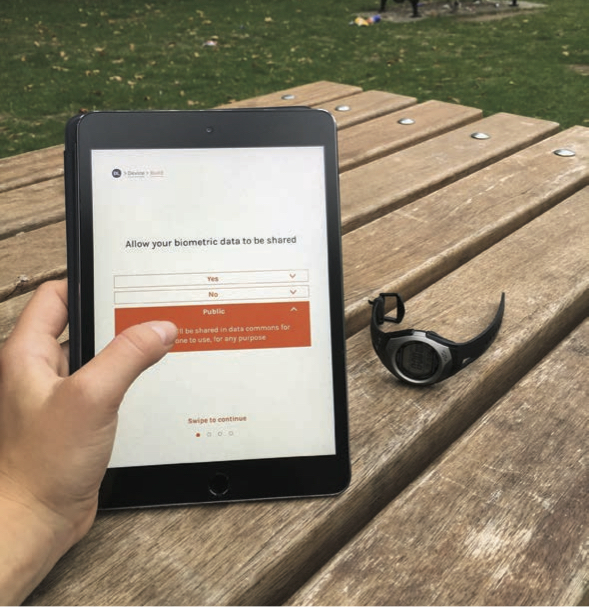

## New Civic
*Sarah Gold*
 
 
 
### ‘Beneath the paving stones, the cloud’ _(James Bridle, 2015)_
Each time we use a connected product or service we generate a tsunami of personal data. It is difficult to grasp the scale of our data output because it is so vast; it’s something like each of us posting 27 million Tweets every day. Companies aggressively collect our data, because it fuels their businesses. They make huge profits from processing our information and often selling it to advertisers. The problem is that we have no control of our data: we have no say in who can collect it, what they can do with it or where they store it. We are all in a position now where we each have huge quantities of data fragmented across the internet, stored in centralised silos out of our reach.

As our digital culture rapidly propels us closer to the impending Internet of Things, where the internet will be embedded in all things around us, the quantity and detail of the information collected about us is about to dramatically increase. In fact, in this Internet of Things scenario, more information will be produced each day than has ever been created. The incumbent internet giants are likely to remain the main technology providers because they continue to invest in new opportunities for their products and services. This means these companies will continue to dominate our lives and our futures. As Margrethe Vestager acknowledged recently: we live in the Google age.

But there is a problem, because many of these platforms and tools are not just commodities, as they are challenging and fundamentally changing our civic frameworks: our privacy, our culture, our laws and our finance. In many ways, digital services like Google, Uber and AirBnb are the infrastructures of the 21st century. The question is who controls these technologies? Who writes the code and who owns the data? To whom are these technologies accountable?

In the 20th century our infrastructures and utilities were railways, roads and electricity – platforms built for the common good and designed to support innovation through open design standards. Now our infrastructures and utilities are Uber, Twitter, Google – owned by private companies that operate within a very narrow venture capital investment model. The products and services they support have very little to do with citizens, and everything to do with their business interests. There is growing concern that these digital infrastructures will fail if they continue to be developed as centralised, unequal and undemocratic utilities. The uncomfortable truth is that we cannot continue to build public resources dominated by private interests.

### There is another way
Decentralised technologies offer a convincing alternative to the mainstream. Decentralisation can appear in many different forms: from mesh networks for community powered WiFi, to blockchain technology that provides trust without the need of intermediaries, to hardware that promises the provision of off grid power. Each of these technologies provide the technical possibility of redistributing the governance, ownership and economics that sit behind a technology from one central authority to, where appropriate, everyone. Decentralisation could bring about a more democratic future where our utilities and infrastructures are built for common good. We could own our data, and be in control of its use and storage. We could redesign our citizenship, embedding our rights within the code of the technologies themselves.
It’s an exciting prospect.

Decentralisation is, by its nature, disruptive. But for decentralisation to make positive social impact, we must consider and design the civic frameworks that sit behind the technology. Because design and technology, however they are structured, will always influence new politics. We need to optimise decentralised technologies for people, to make products and services that are capable of supporting us not just as consumers, but citizens too. We must consider and test different models for control, ownership and accountability of our technologies.

Since my industrial design masters project – the Alternet, a proposal for a fair trade Internet, completed in 2014 – I have been exploring ideas for how we might produce digital products and services that are designed for the common good. I am interested in developing, testing and building digital tools for a more democratic future. Data Licences, exhibited at the V&A’s Digital Design Weekend, is a prototype for one such digital tool. It demonstrates the feasibility of open standards for data – federated data licences, nested in code, powered by a blockchain.

Data licences are essentially a new form of terms and conditions that flip the data paradigm so we own our data. Each data licence (biometric, financial, location...) is customised by the individual, so they can decide whether to share their data or not, who they share with and how their data can be used. The licences are customised by answering straightforward questions on a digital interface. Each licence is interoperable between humans and machines, as licences are made of human, machine and legal readable layers. So once the licence has been confirmed, it can be automatically stored on the blockchain – a marketplace for personal data, where the new data trade can take place transparently. Data licences are intended to empower individuals not just as data producers, but as citizens with rights and powers. With the Internet of Things, smart homes and our ever increasing array of connected devices, who owns the data is becoming a question we cannot ignore any longer.
