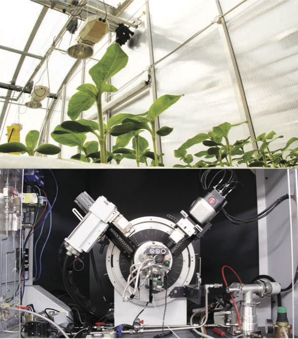

## The Instruments Of The Afterlife
*Instruments Of The Afterlife*
 
 
 
‘Close a pit, kill a community’. This slogan, adopted by Welsh miners during the struggles against the mine closures in the 1980s, marks the significance between land, industry and community. Welsh miners, like their counterparts across the UK, knew the importance of the land as the life-blood of the mining community. This close-knit community prospered during the industrial revolution, but as energy preferences changed, the pits closed and its community slowly disbanded. What remains in the traces of heavy metals in the soil, is a shadow of the people and a disappearing way of life.

Today we face the consequences of the fossil fuels that powered the industrial revolution – from environmental change, to an exploding global population with a hunger for materials to build the new world. Technological progress ushers in the next revolution that will build new relationships with our environment through synthetic biology, plant science and nanotechnology.

In response, an art piece presents a future where the cleaning of polluted land is shaped by an alternative set of beliefs that could mould the new technological revolution. A set of instruments have been created to promote a system of mutual relationships between humans, plants, bacteria and fungi. The system recovers valuable nanometals from the contaminated soil. Instead of using fossil fuels (the remains of life forms from the distant past), technology now uses the contamination left behind by the miners and more recent communities. The musical vibrations produced by the instruments celebrate the past communities’ contribution to the present whilst creating physical material from their lives to build the future. This functionality of the instruments moves humans towards a web of relationships between many living components, similar to those found in the biosphere. Together, we enter a future vision where our energy needs and planetary consumption are balanced, and self-sustaining systems have little impact.

The art piece is based on the scientific research, ‘Cleaning Land for Wealth’, funded by the UK’s Engineering and Physical Sciences Research Council. This innovative research project involves a number of leading British Universities. The scientists explain their work:

‘The scientific research uses bacteria to produce nanoparticles from plants, which can be used to collect contaminants. The idea is to bring back to life areas of land lost through centuries of mis-use, making land decontamination financially viable, and providing our manufacturing industries with new material, without the need for mining or smelting. But just how much wealth really is beneath our feet? In short, it is very significant. Globally, substantial land contamination exists and blights the lives of millions, but it is poorly quantified, particularly within poor and developing nations where there is limited financial motivation for this to be addressed.

We do know that there are nearly three million ‘polluting activities’ and 350,000 sites affected by soil contamination that could cost €350bn to treat in the European Union...Almost two-thirds of the contaminated land in England and Wales contains metals (...and metalloids) – with arsenic and nickel accounting for about 40% of this. We have chosen to shine a light on our research through the lens of artists Burton-Nitta with help from the Creative Outreach Resource Efficiency team.’

***Artists:** Michael Burton & Michiko Nitta Composer: Neil Luck  
**Musician:** Lawrence Tatnall  

**Scientific team leaders:**  
**Cleaning Land for Wealth (CL4W):** Dr Kerry Kirwan, University of Warwick  
**CL4W Outreach:** Dr Louise Horsfall, University of Edinburgh  
**Creative Outreach For Resource Efficiency:** Professor Jacqui Glass, Loughborough University  
www.core-community.net  
More info: www.burtonnitta.co.uk*
