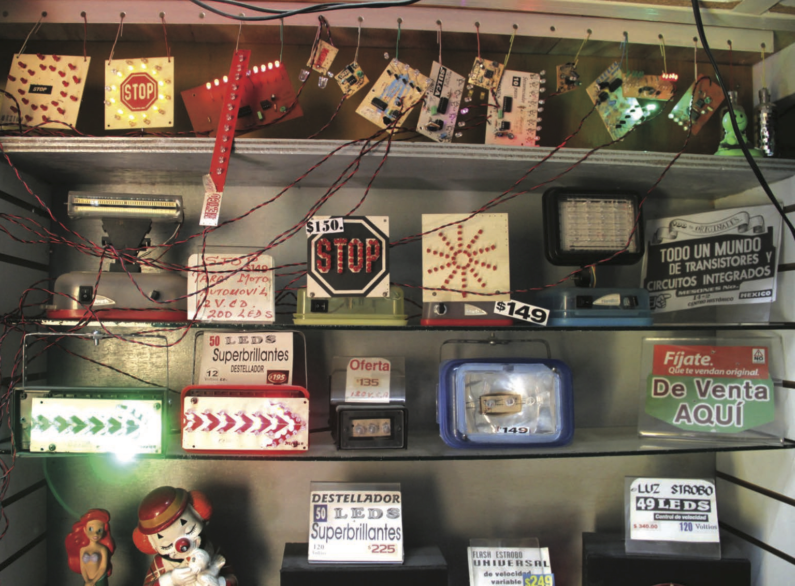

## Crafting the Digital
**
 
 
 
When Irini Papadimitriou asked us to write a reflective piece on crafting the digital that drew on the activities and content of this publication we decided to take an open ended, and perhaps somewhat wandering approach. An approach that mingled thoughts from personal interests and experiences as much as from our professional practice. An approach that wanders between the practicalities of approaching the creation of objects from a pre-industrial production stance to the sensitivities of crafting objects in relation to people and the complex messy lives they lead. We wanted to give our view on the ways in which the methods and mindsets of craft can provide a new perspective on the future of digital and the expectations, hopes and aspirations we have for it. We’re Justin Marshall a Digital Craftsperson, Jon Rogers a Creative Technologist and Jayne Wallace a Digital Jeweller.

We think that craft sensibility can extend beyond the scope of material interaction, to engagement with people and situations as a broadly empathetic way of exploring the world. In this way we are not limited to talking about craft as a specific area of professional practice, material specialism or a defined sector of the creative economy, but as a model for organising production (and consumption) and as an approach and mindset that can be recognised within many practices and professions. Before we start to apply this, let’s define what we mean by ‘pre-industrial forms of production’.

Pre-industrial forms of production can be characterised as being localised and flexible, often producing bespoke items or variants appropriate to the needs of an individual, a community, or the conditions of a particular place. Design and production are more intimately integrated than in the industrial mode of production and carried out by multiple small-scale enterprises; it is disaggregated rather than centralised and this is mirrored in how people purchase products, less homogenized and uniform, and perhaps more limited in choice, but more locally specific and relevant.

With this lens on where we are coming from in place, we need to ask the fundamental question of how is this relevant to the global marketplaces of today and ubiquity of the digital? We’re going to respond to this by drawing on the many different voices and cultures that are captured in this publication. Starting with Miriam Mabel Martínez’ piece ‘Vanguardism of the Periphery’
her group ‘tour’ of Mexico city is described in terms of a pre/post industrial cityscape of consumption and production, where there are areas in which ‘every street is a specialized branch’, small-scale individual businesses provide diversity and choice, not international, or even national, chain or department stores.

A store of digital devices and is visited which is described, (as is the whole city), as a ‘lab’ in which the proprietor does not just sell, but also creates, bespoke and personalised digital devices, in pre-industrial craft terminology he runs a work-shop a place of design, production and consumption. Other descriptions of visiting a ‘bazaar’ of digital componentry, in which everything makers needs to wrangle their own personal digital devices is available, conjures up a vision that is truly the antithesis of an Apple Store.

But this, of course, is not peculiar only to Mexico, these descriptions align with the authors’ collective experiences of a recent visit to the historic, but highly active and commercially vibrant, Chandni Chowk market in Delhi. This is made up of vast numbers of small-scale specialist businesses, aggregated into areas of specialisation, providing the benefits of choice and variety, but without being conglomerated into single large stores. Differing commercial activities sit alongside each other here, areas of locally produced and context specific products and services rub up against areas, such as the electronics market, which draw on global distribution networks; the pre-industrial meets 21st century business models in ways that appear to meet many of the current needs of local consumers. In addition this model empowers local entrepreneurs, providing opportunities and space, that, if businesses became subsumed into larger corporate structures, would not be available. The power and value of the local is raised in other DDW texts. Andrew Prescott in ‘Being Local and Connected’ demonstrates how the ‘local can retain its distinctive character in an increasingly globalised and corporate world’ with an example of how
at the end of the19th century the city of Hull, reacting against the monopolies and high costs of large private telephone companies, set up their own telephone systems. This is made wonderfully tangible through a network of white rather than red phone boxes, a physical manifestation of civic pride and power.

A parallel might be drawn here with the virtual space of the web, it’s not meant to be a single place (e.g. FaceBook), it’s meant to be lots of disaggregated interconnected, emergent places, a bazaar, not a Wal-Mart. Miguel Angel Angeles highlights this in his piece on ‘Coding Mexico’ where he describes this megalopolis as a ‘multi-coloured algorithm called Mexico’, which conjures up more than colour, but texture and the very materiality of place. This lovely way of thinking about a city is a call to action to take a crafted view of the things we do in a city - where there is ‘no limit and no format’. This captures the very essence of a web that is not a homogenous smooth material but is rather a complicated variable structure containing many different textures. It is this very materiality and physicality of digital and
the web that we want to talk about.

Sensitivity to the affordances of materials and celebrating process through making its traces visible, are commonly understood as part of the ethos of a craft practice. There is a useful distinction that can be drawn out here between how many industrial designers approach material characteristics and how craft practitioners deal with physical affordances and approach the inherent inconsistencies of natural materials. Arguably a prevailing aspiration of the industrial designer is to work with materials with definable ubiquitous characteristics that allow repeatability and consistency; to have complete control of materials and to render the process of production invisible. In contrast, the perhaps humbler, overriding craft approach is to work with the inconsistencies in materials and specific situations; to make process manifest, to work with, not against, the knots and grain in wood, take on the complexities and contradictions in human needs and desires and to be sensitive to the opportunities they may hold for revealing new possibilities for expression and avenues of investigation.

There is a relinquishing of control, even if only partly or intermittently, therein. This is not to align only, or all, beneficial characteristics to a craft approach to the detriment of design, that would be a falsehood - but collectively we have talked about what craft as an ethos and way of doing enables, in our views, and where this departs from design.

In the context of craft and the digital the different approaches to materiality yield very different visions of what our digital culture can be and what it means to be a human living amongst and through these things. The ‘industrial’ approach assumes, or commonly aspires to, digital ‘smoothness’, where there is consistency and ubiquity of access and bandwidth - and largely achieves this with big expensive tools. The reality of the digital as a material however, is often lumpy and inconsistent. The digital craft approach recognises that there are digital knots, veins, ages, thicknesses - so when we do not have the quantitative power of the latest technologies, the fastest broadband or the democratic benefits of open and unrestricted access, we may need a qualitative and sensitive approach in order to craft valuable outcomes through taking a very human perspective. To enable this to happen, we also need to be including open and collaborative methods that the communities of hackers, makers and tinkerers are attempting to do. We say attempting, as we don’t think they’re there yet, but it feels the right way to start to deal with this very material, complex digital space that we are working in.

With that said, we wanted to talk a bit about how design fits in with this. As where design thinks very generally about what humans are, what human experience is and what human relationships are like, craft has always been in the business of thinking about the individual, their idiosyncrasies, their atypical ways of being and responding to these more specific quirks, oddities and lack of ‘smoothness’.

There are parallels to be made between how a craft approach works things out in the situation, recognizes that you need to expect surprises, and through an iterative process moves forward to reach an, often provisional, resolution, and how a craft driven vision of our digital culture opens up new possibilities for individual, atypical things, systems and personal agency. In responding to the quirks of being human you find sets of different constraints that make you think very differently about potential outcomes. Just as we experienced when working in India and Mexico, there were very strong socio- cultural-economic constraints there that made people think very differently about how you could produce something and what it was you would produce. Many of the ad-hoc networks and processes that we saw playing out demonstrated how what craft does is utilise the idea of ‘to-hand-ness’ and the specificity of the situation. That might be just in terms of materials and tools or networked process, but as we know from our own experiences, and as shown in much of the writing in this book, this also extends to making changes in socio-political contexts. This opportunistic approach, employing ad-hoc solutions that become refined through iterations underlies working with a knotty piece of wood as much as working within complex social contexts. This is the antithesis of much sophisticated industrial design, particularly in relation to the digital, where the designer is not looking to what is to hand, but aggregating a whole global potentiality for production.

Although we would emphasise that crafting, as a process, does not have only to be aligned with creation of physical items, we believe that a recognition of the value of physicality and the physical characteristics of objects is still an important aspect of a digital craft sensibility - emphasising the ‘thing’ in the internet of things. That we are learning from our thousands of years history of making in a physical world to influence the twenty five years of making in a digital connected world. Goldsmith’s Interaction Research Studio’s ‘Datacatcher’ project provides some useful discussion points here. Through the deployment of bespoke mobile physical devices this project provided the public with a way of accessing the ‘sociopolitical texture of local neighbourhoods’. In response to this project the question ‘Why is it not an app?’ was often raised. Although it may be true that all the device’s functionality (and much more) could have been achieved as an app, Bill Gaver argues, as would we, that the project’s impact and value would have been challenged. In the project’s documentary film participants discuss the importance of the unique form and physicality of the device, the Datacatcher’s ‘quirky’ characteristics whetted public interest and instigated new interactions and conversations about the data being displayed and what it means to them - one of aspirations of the project. Unlike an app running on a ubiquitous digital device, the Datacatcher’s form embodies and promotes its function.

The 3D printed devices may not immediately exude all the characteristics one might want and expect from a crafted object, but they are bespoke artifacts, tailored to a specific context and crafted to achieve a limited set of very particular tasks, they are ‘made-to-measure’, and therefore can be set against the multi-functional universal design of many mass produced digital devices. There is a strong sense in Gaver’s work and other work within this publication that is calling for a future where the things we have closely correlate to, and naturally fit with, the values we might live our lives by. That things might be with us for generations and they will draw from many global cultures – cultures that exist beyond the industrial view of a smooth digital future.

This aspiration connects to what Irini and the V&A instigated in the UKMX event and the unfolding stories. Immersing yourself in different cultural contexts enables you to see digital in a new way, particularly when they’re craft based economies – if we are going to learn about the future we probably don’t want to go to Silicon valley, because we are not going to craft the future with Apple, Google and Amazon at the helm. We think it’s going to come from unexpected places – we don’t know where, but going to places like Mexico and connecting to their cultures of digital making is one strategy for investigating this and may give rise to some very alternate and bespoke digital futures. If we also look closer to home, ‘imperfect’ digital devices and systems are being created with an open source ethos by independent innovators at hackathons and in makerspaces and fablabs across the world. These emerging networks are getting traction with some big organisations, as we can see in the way the Mike Saunby at the Met Office talks about where the future of digital is going to come from.

As a final thought we want to reflect on a quote within Andrew Prescott’s piece, where he writes ‘Networks can enable the local to be linked into the wider world, but still allow a distinctive local character.’ This sensitivity or attunement to the ‘local’ when creating connections between people, things and places through the digital, is something that we recognise as a characteristic of a craft approach, it enables people, places and their ‘things’ to retain their particular and idiosyncratic textures. We know that whatever happens, we’re going to walk into our digital futures, this much is certain. Our proposition to you is whether we take the choice to create a crafted digital future or something else altogether. With this in mind, let’s look at what this means from the two perspectives we outlined at the start of our reflection and why this matters to us. Craft and pre-industrial production and in relation to a sensitivity to things, people and process that focuses on the individual and the idiosyncratic. This is in contrast to the current model of global infinites in terms of production networks, materials, processes and homogeneity of form.

This is a model where you’d never in a small city like Dundee having anything to offer Mexico City; you’d never stop to ask people in India why they are making things and reflect on why we’re not? You’d never learn anything from the thousands of years humanity has spent crafting a remarkable existence on a simple big round rock with one hundred and eighteen building blocks to make things with. And perhaps as Andrew Prescott has said: ‘Larkin cherished Hull’s sense of being on the edge, of creativity flowing from the anomalous, marginal and misplaced.’ this might just be the poetry we all need to reflect on in order to start to think what our crafted digital future might be.

_Team: Justin Marshall, Jon Rogers and Jayne Wallace_

*Shelves of electronics in Mr Sulca’s Electronic Shop.*
