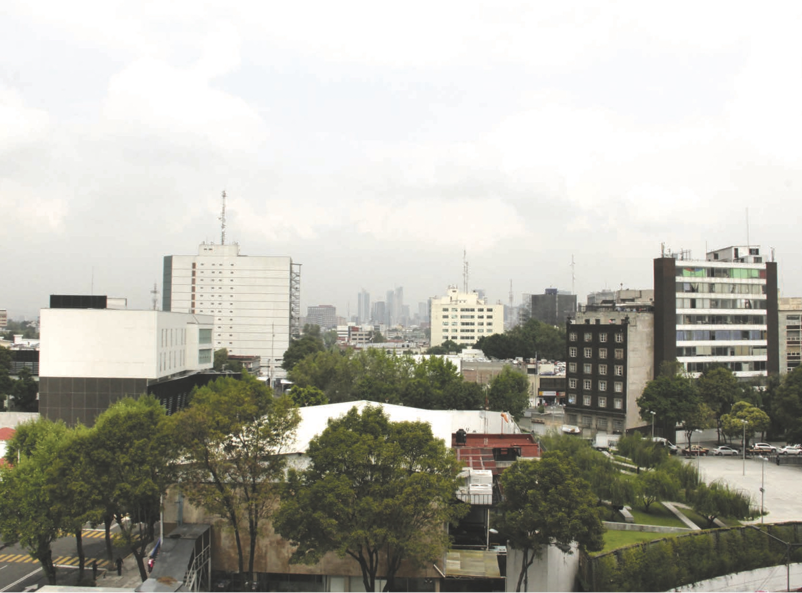

<nav aria-label="...">
  <ul class="pager">
    <li class="next"><a href="02.html">Next &rarr;</a></li>
  </ul>
</nav>

---

## It all started in Mexico and Dundee!
*Irini Papadimitriou*
 
 
 
I’m writing this sitting at my temporary working space at the Wits Art Museum in Braamfontein, one of Johannesburg’s most energetic, vibrant, and also fast changing districts. This is where for the next few weeks, working with a group of artists, designers and people from the surrounding area, we will be exploring cultural technologies and futurist visions of the city, through a series of public activities and creative collaborative events.

Usually when we speak about or imagine the future and the changing face of our environment, we are presented with a vision that is not human, an image that lacks personal stories. Such visions present us with technological wonders – such as drones, bitcoins, apps, 3D printing and VR headsets – which all-too- often take precedence over the people who will live with these advancements. Here in Johannesburg, I am part of an exciting project that is part of Fak’ugesi the African Digital Innovation Festival. This work aims to put people first: to hear their voices, harness their creativity and find their stories of what they would do with emerging and everyday technologies.

Sitting here in South Africa, wondering what might unfold over the coming days of making, takes me back to the start of the journey of the publication for this year’s V&A Digital Design Weekend. Crafting our Digital Futures is a collection of projects, collaborations, ideas and exchanges that explore how people can shape the future of the digital world they want. The works draw from communities and cities, from civic awareness, engagement and making, and innovation. What ties all of this together is my belief that innovation happens in unexpected places, and very often emerges from grassroots activities. It is unashamedly driven by valuing the bringing together of people, many of whom will not know each other, and creating a space during the Digital Design Weekend for them to share ideas and skills, to make things collaboratively, and fundamentally to take action and craft their environment to bring about the digital future that they want.

### And it all started in Mexico City and Dundee!

Earlier this year, I had the great opportunity to join a team of brilliant people from across the UK and Mexico City. With the support of the British Council, we started a very exciting journey connecting people across the Atlantic in a series of cultural exchanges, the Digital Futures UKMX, part of our monthly Digital Futures meetup that is an open platform for displaying and discussing work. Digital Futures UKMX took place as part of the Dual Year of UK and Mexico 2015; a year-long celebration of cultural, educational and business exchange between the two nations.

The event brought together communities in Mexico City and Dundee to explore, develop and co-design open collaborative tools and projects addressing issues such as the environment, climate, open data, waste, sustainability and more. Participants on both sides of the Atlantic joined with incredible enthusiasm to explore their cities in new ways and show how working collaboratively can influence, improve or change the civic design of our communities, cities, public space, the web and more.

During a long weekend of joined events and conversations, we explored the different layers of these two cities, encompassing visible and invisible networks, markets, local crafts, artisans and foods. We exchanged photos, sounds, videos, and even recipes, from the two cities! By starting a cultural exchange based on our very human lives, we may not have always followed the routes that a new tourist to Mexico or Dundee might take, but sought to explore the city through each other’s eyes.

I am sure that Mexico and Dundee are not two cities that would be people’s natural first choice for a twinning exercise of this kind. However, when framed as an exploration of innovation coming from unexpected places, then inviting people from a huge city like Mexico City, with a population of 22 million, and Dundee, which has less than 150,000, starts to make more sense. To bring people together from these two very different cities was a great chance for thinking about common links and the challenges we face in both a megacity and a small one. What’s interesting is that since we’ve been exploring design across these two cities, we’re uncovering more and more unexpected connections; connections which are helping to form a deeper cultural exchange. Andrew Prescott, the AHRC Leadership Fellow for Digital Transformations, did a bit of digging around in the archives of Dundee and discovered some rather exciting connections between these two cities. I’ll not spoil what he found: you’ll have to do some digging of your own into this very publication to find out for yourself.

Coming back to the Digital Design Weekend, our biggest event of the year, is a great opportunity – and with no little thanks to the valuable support and contribution from the Arts and Humanities Research Council Digital Transformations Theme - to bring into the conversation not only the partners and work created during the Mexico City and Dundee exchange, but also many other brilliant projects, designers, artists, makers and collectives that explore and enable civic engagement. Helping to bring out people’s inventive, engineering and making skills and present us with powerful ways of solving contemporary problems. The things that you’re now going to read about are far from the maddeningly mass-produced and the uniform, a route down which some might fear digital design might be heading. It rather presents a collection of highly crafted, bespoke and personalised responses to a multitude of alternative futures. A series of futures that we can see are crafted for people. Thank you for taking time to explore with us the start of our journey.

---

<nav aria-label="...">
  <ul class="pager">
    <li class="next"><a href="02.html">Next &rarr;</a></li>
  </ul>
</nav>
