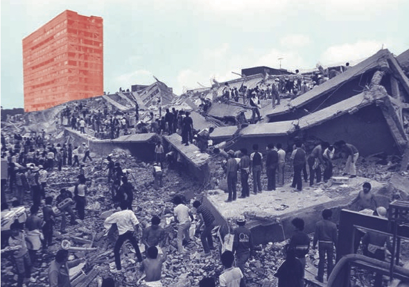
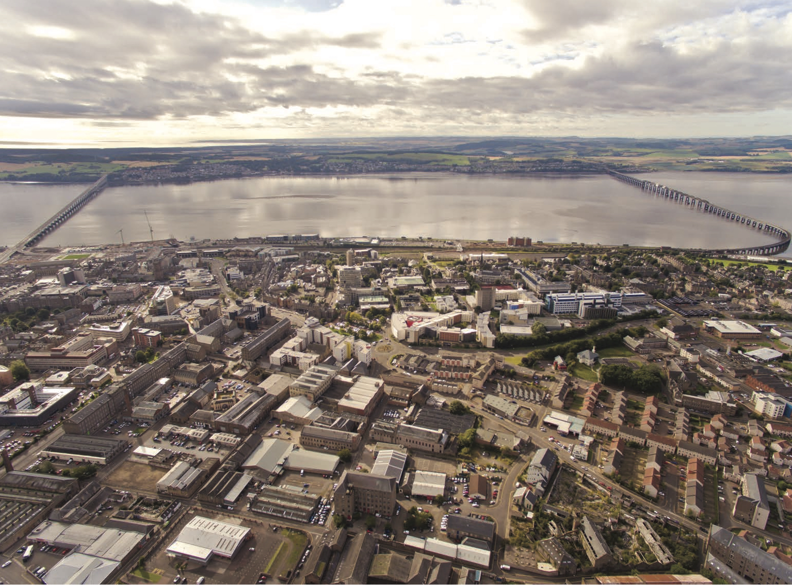

<nav aria-label="...">
  <ul class="pager">
    <li class="previous"><a href="05.html">&larr; Previous</a></li>
    <li class="next"><a href="07.html">Next &rarr;</a></li>
  </ul>
</nav>

---

## Under Debris And Over Engagement - The Shift Of Civic Engagement In Mexico City
**
 
 
 
Thirty years ago, the morning of the 19th of September, Mexico City woke up early to the frightening shake of one of the world’s biggest earthquakes. In less than five minutes, the 8.1 magnitude movement crumbled a vast part of the city center and its surrounding neighbourhoods. It was the biggest tragedy the modern city had ever lived. The promise of progress and profit from the welfare state was pulverized to pieces leaving a city of 9 million people with the uncertainty of the unknown. The deaths are calculated at 10,000 although the number differs depending on the source, Red Cross said in 2012 that it could have escalated up to 15,000. Mexico City was not prepared for this. Every protocol had to be improvised.

While the government organized its hospitals, its diplomatic relationships and calculated the damage, it was the citizens who were coming together to overcome adversity. The organic constitution in committees soon had an established system that was able to count missing persons, clean debris, rescue victims and channel them to hospitals. Citizens were shaping the solutions. By the end of the week, a citizen organized group later nicknamed as topos (‘moles’, a concept coined due to their capacity to dig inside the earth and save victims out of the ruins) became the official rescue team of the crucial tasks. The federal government was harshly criticized for its slow reaction and its lack of planning for the unexpected. It was clear for everyone that the System alone was not enough, it had enormous shortcomings. People took the city into their own hands and the true colours of resilience started to emerge.

The turmoil of 1985 was the deciding moment for Mexico City when citizens demanded change. The city needed more than physical reconstruction, it urged for social glue and a shift in paradigms, there was a big task that implied rebuilding the trust between citizens and governments. It not only had to do with the practicality in resolving urgent matters, but in designing better solutions jointly. Back in the 1980’s the dusty Mexico City didn’t have a meaningful ecosystem of NGO’s, proactive citizens or a conscient government that understood the importance of citizen solutions, the earthquake marked this split, practically and metaphorically. It’s easy to say, but thirty years have gone by since that first approach to an improvised but solid exercise of civic engagement. With three decades separating us from that crucial moment and an important gap in generations, the question is now not if citizens can engage in civic matters, but what has the city learned and taught throughout the generations? A lot. NGO’s that were born in that moment now continue to run and have been able to change security protocols, in architecture and health matters. One of the biggest problems regarding the slow response was the political organization of the city that depended on a Federal apparatus and didn’t take decisions on a local scale, public positions were appointed directly by the president and these in turn elected their own administration.

1985 was a moment that made clear the city had to be able to take decisions quicker, in a local organization and not a federal one, and that is why the first model of a democratic city government was elected in 1997. This shift towards a more autonomous metropolis and the consolidation of a progressive model acknowledged civic organizations to take part inside the government’s decisions. Proof of the maturity of this model is Laboratorio para la Ciudad (Laboratory for the City), a new and young innovation office inside the Mexico City government.

The Lab for the City was born within the governmental structure in March 2013 with huge expectations. Although it was conceived as part of the city government it was leveraged by a group of young people with very diverse and professional backgrounds who were born circa 1985, ‘the generation of the earthquake’. A generation who grew up shaped into the scepticism of a trustworthy government and the fail of postmodernity but also, constantly reminded of the power that society has when it’s organized and it engages in civic matters. A group of young leaders who acknowledge the premise that if they wanted things done they had to do it themselves. Lab for the City was born to tap into the talent and willingness of these young profiles, proactive and autonomous citizens who believed change was possible and it was just the right climate for Mexico City to shift the notion of the broken system.

The Lab has been running for almost three years now, and civic engagement is one of its core principles and work axis. Through civic engagement the Lab has been able to collect, insert and produce citizen ideas into government. Connecting cities and citizens through government itself is what drives the work at the Lab and it is not only a matter of delivering better services but rather reimagining the role of government and how it can contribute to build a better city. The Lab continuously explores ways to create better channels for engagement that didn’t exist before not only locally, but internationally. Now it’s not about how many projects can a city office produce, but rather how many mind sets can it incubate for change.

Through the empowerment of creative communities, the implementation of open government strategies, the digestion of a shared economy, the sharing of international good practices, the Lab has begun the change. Long gone are the days when the government’s promotion of its public programs didn’t call for civic engagement. Today, it is a normal process for savvy citizens to shape their start-ups with government possibilities. It is the democratization of participation. In order for Mexico to gain a pin on the international map it needs to convert its efforts into internationally recognized public policy and therefore continue to engage with international actors. Digital Futures for the Lab means the possibility to re imagine contemporary civic engagement.

The new agora for civic empowerment now is not only in the streets where it was thirty years ago, but we now have a digital future where society is woven into more powerful movements and lessons. In our Digital Futures citizens can connect to resolve bigger issues, to learn the differences and similarities between cities like Dundee with a population of 140,000 inhabitants and Mexico City with more than 20 million. Digital Futures means speaking the same language, fighting for the same causes, recognizing we all have common problems and savvy solutions. Civic Engagement now is not only local but global, with shared solutions and best practices. Thirty years ago and under the debris Mexico City had its first demonstration of civic engagement that shaped the possibilities of the contemporary city, now Mexico City is constantly being shaped by all the voices that help reimagine the role of citizens with their city and their government.

*Looking north over Dundee showing the waterfront development and site for V&A Dundee.*

---

<nav aria-label="...">
  <ul class="pager">
    <li class="previous"><a href="05.html">&larr; Previous</a></li>
    <li class="next"><a href="07.html">Next &rarr;</a></li>
  </ul>
</nav>
