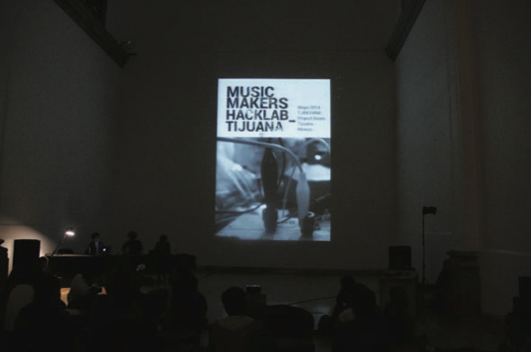
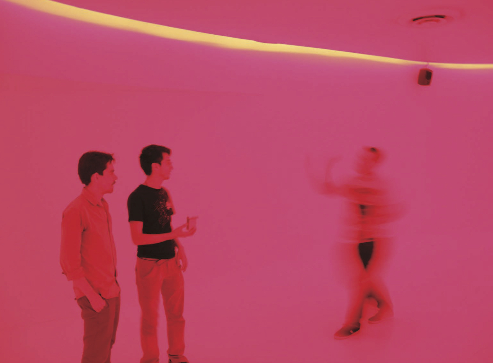

<nav aria-label="...">
  <ul class="pager">
    <li class="previous"><a href="07.html">&larr; Previous</a></li>
    <li class="next"><a href="09.html">Next &rarr;</a></li>
  </ul>
</nav>

---

## Interspecifics, Astrovandalistas, MusicMakers Hacklab & Colectivo Chipotle: Maker-Art-Collectives From Mexico
*Laboratorio Arte Alameda*
 
 
 
Apart from purely conceptual artists – who are quite a rare species – all artists are makers. Nothing compares to the feeling of inventing something and constructing it; it is in our ‘nature.’ However, the act of making seems to have been taken away from the hands of everybody and, gradually, the role of the maker has been assigned and reduced exclusively to artists and craftspeople. The homogenizing drive has almost erased the workspace and typing now seems to be the handiest activity in many people’s daily life.

In the meantime, our planet’s stability has reached several critical points that call for everyone’s participation. Sustainability is the key concept if we want to continue to populate this world, and collaboration a necessary condition for including everyone in the plan. How can we learn again to do so? Artists – like everyone else – need to ask and seek for the answers, and some of them are really doing it well.

Trying several forms of collaboration, investigating a multitude of key topics in a plethora of disciplines, experimenting with models for our environment’s sustainability, prototyping, building, and having fun doing all of that – the forthcoming revolution, expected to be focused on labor, has a different tone this time. Our motivation on this occasion is not supported by the idea of progress but more precisely by that of survival; the question is, how can we make it possible.

For the Digital Futures event in Mexico City, Laboratorio Arte Alameda invited four influential maker art-collectives: Astrovandalistas, MusicMakers Hacklab, Interspecifics, and Colectivo Chipotle. With different approaches to Maker and DIY cultures, and coming from cities all around Mexico, their practice is based on research, action, making, and sharing knowledge. We happily share with UK makers a brief profile of each art collective.

Astrovandalistas was founded in 2010 in Tijuana, a city in the north of Mexico on the border with the United States. With a singular relation to technology, Tijuana is mostly a city of “maquiladoras,” in which large-scale industries such as electronics, aeronautics, energy, and the like have established thousands of assembly plants. Astrovandalistas combine research, artistic action, and experimentation with different technologies, activism, urban hacking, and open knowledge. They operate as a decentralized laboratory in different locations in Latin America, such as Mexico and Brazil, and the United States, developing low-tech tools that enable new forms of communication and collective participation with open software and open hardware that can be easily replicated.

MusicMakers Hacklab is a week-long open collaborative laboratory focused on the transdisciplinary exploration of possible relationships between body and sound, hosted by Peter Kirn of CTM Berlin, and Leslie García/Paloma López in Mexico City and Tijuana. During the MusicMakers Hacklab week each of the participants builds systems and instruments based on processes like sonification of biological organisms, aural and sonic stimulation, and the amplification of body sounds. At the end of the laboratory participants show their projects at a live act. MusicMakers Hacklab has released the recorded pieces in wonderful cassette editions, and has produced a printed publication with the participation of young researchers and critics who wrote about the multiplicity of processes that took place during the event. The questions and explorations proposed by these collaborative and open laboratory dynamics trigger very singular experiences that enable us to see the importance and enormous potential of artistic research in understanding and inquiring into our present.

Interspecifics is a multispecies collective experimenting in the intersection between art, science, and technology, which embraces hybridized practices among different disciplines and living organisms. This collective is interested in the exploration and experimentation in hybrid systems that connect bio- organisms and machines. Some of their projects include The Energy Bending Lab, an instrument comprised of a set of custom-built modular synthesizers and transduction tools that create real-time sonification from the electric properties found in some bacteria. Through the use of cymatics – visible frequency vibrations – it is later converted into a visual pattern generator. For us at Laboratorio Arte Alameda it is of great interest to be close to what new generations of artists are thinking and enquiring about life. The DIY approach to these practices results in a very effective way of sharing and opening up what otherwise would be a quite closed kind of knowledge. It is amazing to see how the so-called ‘general audiences’ can learn about some of the ideas in this new understanding of live processes, which are key to understanding our present and exploring what life may be like in the future. Interspecifics’ experimental and artistic approach is what makes this process so exceptional and a very different experience from learning about synthetic biology through formal methods.

Colectivo Chipotle gathers visual artists, programmers, cultural producers, and musicians, who share an interest and life experiences in video games, informatics aesthetics and 8-bit music. This collective organizes Format DF, the first annual chiptune festival in Mexico City with guests from different countries. Chipotle regularly organizes chiptunes and circuit bending workshops. Format DF is an open access festival offering great experiences centered in the experimentation with 8-bit sound as well as hacking and circuit bending old toys for lots of young musicians and music lovers.

*Francisco, Salvador and Martin demonstrating ‘Linking Places’ in Memorial Room at the Centro de Cultura Digital.*

---

<nav aria-label="...">
  <ul class="pager">
    <li class="previous"><a href="07.html">&larr; Previous</a></li>
    <li class="next"><a href="09.html">Next &rarr;</a></li>
  </ul>
</nav>
