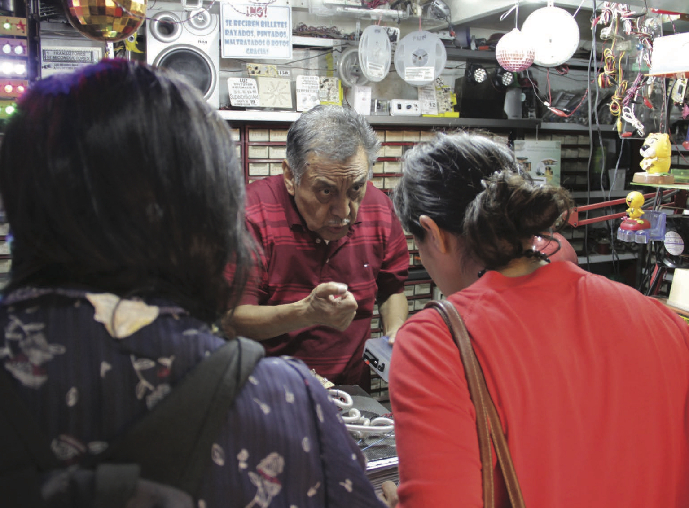

## Innovating The Future Of The Arts
*Bhavani Esapathi*
 
 
 

Technology isn’t the answer to everything. It’s the answer to many things. What do I mean by that? We live in a society of multiplicities where solutions are always plural, there is no one solution rather it’s the choices that determine the future. Innovation up until now has been about having access to resources and closely tied in with the economy. In the post-capitalistic sharing economy, the word economy itself has been innovated. With less than 3.74 degrees of separation between us, people are now the currency that drives innovation
in industries.

### Conditions for Innovation in the Arts
So what are the conditions that make it possible for cultural industries to innovate? Designing innovation within the sharing economy has very little to do with coming up with something new, but following the patterns that reveal what the economy needs. Everything we have been told about innovating is made redundant within the digital-social, the sharing economy thrives on collaboration to excavate something new rather than invent it. From Instagram to Uber, Kevin Systrom did not invent photography but simply made it easy for image enthusiasts to come together in a single space, neither did Travis Kalanick or Garrett Camp invent taxis but simply made it more accessible. As much as we owe it to Henry Ford & Alexander Wolcott for their inventions of cars & cameras respectively, that’s not what drives the sharing economy today. Because the conditions for innovations today are to engage not just your peers but also the community around you.

The Arts has been contending to define its future now more than ever, especially in light of digital saturation. The future is innovation, it’s made up of the next big innovative idea so it’s fair to argue that we should all be able to approach this notion of everyday innovation with clarity and the conditions that allow it are the same conditions that create this demand; the
sharing economy.

From the rise of creative entrepreneurs to art startups, the nature & being of an artist has fundamentally shifted from a person created exceptional pieces of work in isolation to one whose success is directly linked to the digital economy. The digital landscape has not only nourished the sharing economy but also re-imagined our expectations for creative industries. As the separation between consumers & producers blur together, the creative industry has to re-envision our audiences. The very same audiences who drive change are central to innovating in the arts.

### What can the Arts do?
When we think of civic engagement or equality our minds are predisposed to believe it’s purely of concern to governmental policy-makers or politics at large whereas digital engagement as a whole, which is an integral part of our present civic society is a cultural concern that we need to take seriously.

As art organisations, artists and creative professionals perhaps we are more aligned with engaging the public beyond barriers and digital space gives us the freedom to do so in a variety of ways which wasn’t conceivable before. In fact, the nature of civic engagement is transformed into the everyday from initiating cultural movements with social media posts to participating in online groups that directly speaks from an under-represented community. Accessibility to technology has dispersed social engagement into the hands of the public rather than being institutionally sanctioned.

We are all deeply concerned about the future of arts but have we consciously internationalised the future lies not in a time to come but within the complexities of our collective anticipations? In response to how the future of arts will unfold within the sharing economy, that’s entirely dependent upon the communities we form & the level of engagement we as individuals and as a sector curate within the digital space.

### What does Innovation mean in the Arts?
There are certainly some anxiousness around digital penetration within the arts & museums as a sector and rightly so, because the present dialogues around technology primarily place it as a solution to everything. Technology is only as good as the community behind it and when we acknowledge this, we quickly realise it isn’t the answer to everything but it’s answers are multitude and the ones we actively support will design the future of our industry.

It’s easy to forget the pivotal role civic engagement plays within the sharing economy where every person can determine the value of a thing via a myriad of ways from an Amazon review to a blog post. Whereas the Technology Strategy Board invests over £300 million every year in what can be largely understood as innovation, the true strength behind creative industries would be to leverage communities as active digital members within the innovation process. During the initial tech burst outsourcing was the trend, imagine open sourcing ideas to design projects that is already backed by civic participation. The future of Arts lies not in technology but the degree to which we enable civic engagement that will continue to drive innovation.

*Liliana talks to Mr Sulca about his crafted electronics.*
