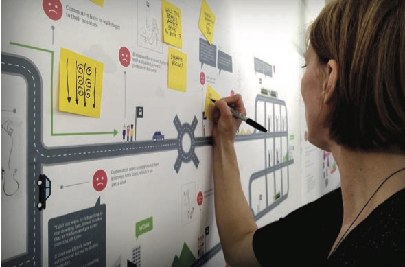

<nav aria-label="...">
  <ul class="pager">
    <li class="previous"><a href="12.html">&larr; Previous</a></li>
    <li class="next"><a href="14.html">Next &rarr;</a></li>
  </ul>
</nav>

---

## Shifting Away From Dependence On The Car: Start With Citizen Diaries
*Anja Maerz*
 
 
 
At Future Cities Catapult we are helping cities to develop new products and services to improve city life. The best way to do this is to start with the citizens themselves, through interviewing, observing and designing with them.

Recently, we’ve used this approach on a project we’re working on in Milton Keynes. Along with Milton Keynes Council and MK:Smart, we’re looking at how new ideas, technologies and data can help nudge citizens towards taking more sustainable modes of transport.
Changing ingrained behaviour such as commuting and transportation choices is complex. Not only do urban infrastructure, planning and services play a role, but so do commuter attitudes, behaviours and needs. And since commuting and mobility may vary from day to day, the team chose to conduct a digital interactive diary study where citizen participants gave permission to share the location data from their phone as well as provide personal comments in an online diary.

This gave the research three key advantages: first, citizens could capture their experiences on their phone in context as and when they happened giving the team both anecdotal ‘rich’ data as well as actual ‘real’ location data; and second, the team could interact with the participant, exchanging comments and questions ‘in the moment’; and third, the team could get the crucial longitudinal perspective of mobility over the course of several ‘commuting cycles’.

### Establishing the Context
Before looking into how to how to change citizen’s travel habits, we needed to understand what modes of transport Milton Keynesians were currently using and why. We began by conducting a qualitative online survey about mobility in Milton Keynes which gave us a baseline dataset for context. From survey participants, social media and other networks, a core group of 14 citizens were selected to be our study group. The group was purposely made up of a mix of very different transport users with a range of attitudes and needs; from those who only take public transport to passionate cyclists, from those who drive wherever possible or those who drive only occasionally, through choice or necessity. There was an eCar driver, car sharers and a cabbie. We had a mix of ages, postcodes and professions.

### Briefing participants
In a briefing workshop, participants were introduced to the diary study and given an identity on Google+ and shown how to record their diary entries. They were also shown how to enable sharing the location data on their phone. The participants made their first diary entry at the briefing workshop using their mobile phone or tablet.

These first entries focussed on who they were and their normal commuting patterns. They were asked to make entries that were as visual as possible so the research team could collect even more insight, including photos, screenshots, even audio and video recordings of their experiences.

### Diary entries
The majority of study participants made entries on a daily basis over the course of 10 days. They posted pictures sitting in traffic, moving large amounts of equipment and waiting at isolated bus stops late at night. They logged screenshots from their favourite bus app, suggested improvements to roundabouts and went into details about the advantages of driving an eCar. And of course, the team had questions for them, lots of questions. Google+ enabled a ‘live’ dialogue around the diary entries: ‘How long were you stuck in traffic?’ ‘How did you feel?’ ‘Why did you have to take all the equipment?’ ‘Is public transport an option for you? Why or why not?’ ‘Why do you think the bus stop is scary?’ ‘Why is this your favourite bus app?’ ‘Why do you feel the roundabout needs improvement?’ ‘Why do you drive an eCar?’ Mainly just ‘Why?’

The interactive dialogue, follow up and interrogation of entries every day helped to begin building the evidence base for insight on the key challenges of mobility in Milton Keynes as well as ideas on how to improve citizen’s experience of getting around the city.

### Evaluation of the diary study: Insights and Opportunities
The team scanned the diary entries looking for patterns – what were the needs of public transport users? How did these match with those of drivers, car sharers or cyclists? Where did citizens see problems and the need for improvement? How did the anecdotal ‘rich’ data conflict or complement the ‘real’ location data? How did these behaviours compare to global best practices for more sustainable mobility in other cities and countries?

The team came up with a number of insights for Milton Keynes: why citizens use and prefer certain modes of transportation, the barriers and opportunities for shifting behaviours, and finally how to improve the citizen experience of all modes of transport. A key insight centred around making transportation more flexible to give citizens more control of their commute.
The team’s visual designer helped communicate the findings by creating representative user journeys showing the positive and negative moments for each mode of transport. For instance, the observation that people may use a bus to get to the supermarket, but a taxi to the home.
The full team of designers, data scientists and researchers the team brainstormed ideas based on these insights and opportunities. For instance, adding simple signage to Milton Keynes’ special cycling and pedestrian ‘Red Ways’ pointing out the direction and distance to key local business headquarters, could not only help with navigation, but also help citizens think of the Red Ways as a commuting option, rather than only a leisure one. Alongside this one, the team created a set of 25 idea cards for improving transport in Milton Keynes.

### Working Together
During a workshop with project sponsors MK:Smart, CommunityAction: MK and members of the council came together to review the findings and generate ideas. By using the user journeys, pictures and verbatim quotes from the diary studies, observations, and interviews, the team were able to demonstrate the insights clearly as straightforward solutions to some of Milton Keynes’ problems – no guessing was necessary. They also presented the idea cards – by combining the Council’s feedback, the citizen’s needs and the ideas for how to improve mobility in Milton Keynes, the team now had a firm evidence base to present to the Council and MK:Smart on how to begin effectively nudging citizens towards more sustainable transport behaviours.

### What’s next for Future Cities Catapult?
As a result of the work, MK:Smart have commissioned a repeat workshop with representatives from the council, the local bus companies and citizens. Together, with expanded support from these key stakeholders, we hope to pilot some of the emerging ideas in Milton Keynes. Learning from citizens first hand– particularly through diary entries of their citizens over time – can help them to improve the city for all.
Besides presenting this work in Milton Keynes at the Digital Design Weekend at the V&A, Future Cities Catapult will also show the findings in their Urban Innovation Centre in Clerkenwell. The learnings from this research are already being applied elsewhere in upcoming work on sustainable behaviour in cities.

---

<nav aria-label="...">
  <ul class="pager">
    <li class="previous"><a href="12.html">&larr; Previous</a></li>
    <li class="next"><a href="14.html">Next &rarr;</a></li>
  </ul>
</nav>
