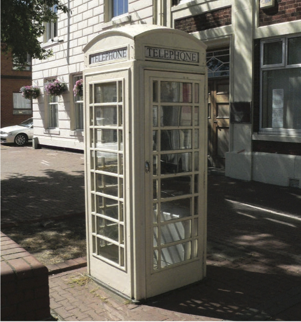

<nav aria-label="...">
  <ul class="pager">
    <li class="previous"><a href="13.html">&larr; Previous</a></li>
    <li class="next"><a href="15.html">Next &rarr;</a></li>
  </ul>
</nav>

---

## Being Local And Connected
*Andrew Prescott*
 
 
 
In March 2015, Newcastle held its first poetry festival. It is surprising that Newcastle hadn’t had a poetry festival before, since it has been for many years a major centre of poetry and is associated with such well-known modern poets as Basil Bunting and Sean O’Brien. Newcastle is also the home of Bloodaxe Books, one of the most influential publishers of poetry in Britain, founded by Neil Astley in 1978. Bloodaxe Books has for over thirty years energetically promoted a distinctive and diverse range of new poets including Jackie Kay, Ian McMillan, Sean O’Brien, Jo Shapcott and Matthew Sweeney.

At a panel held during the Newcastle Poetry Festival, Richard Price, Head of Contemporary British Collections at the British Library and himself a distinguished poet, gave an impassioned defence of the importance of poetry when thinking about urban regeneration and the future of cities. Poetry, declared Price, is at the heart of a successful city. He pointed to the success of Bloodaxe Books in fostering the creative economy of Newcastle. Bloodaxe shows how poetry counts and how every successful city needs poetry.

I had earlier thought about the role of poetry in urban regeneration when visiting Hull to attend the Digital Utopias event organised by Arts Council England with the support of Google, the Arts and Humanities Research Council (AHRC) and other partners at the Hull Truck Theatre. Hull is 2017 City of Culture, and the latest in a succession of places hoping that culture will be the key to urban regeneration. Phillip Larkin is not the sort of person who would have been enthused by the idea of a ‘city of culture’ but it is nevertheless striking how Larkin was a tutelary deity for Hull’s 2017 bid.

Hull, Larkin declared, was a good place to write, ‘for a place cannot produce poems: it can only not prevent them, and Hull is good at that’. Larkin cherished Hull’s sense of being on the edge, of creativity flowing from the anomalous, marginal and misplaced. Larkin elegantly captured this liminal spirit in the foreword to the 1982 collection of poetry from Hull, A Rumoured City (which was published by Bloodaxe Books): ‘People are slow to leave [Hull], quick to return. And there are others who come, as they think, for a year or two, and stay a lifetime, sensing that they have found a city that is in the world, yet sufficiently on the edge of it to have a different resonance’.

Hull, for Larkin, offered an antidote to the forced and contrived creativity that many modern towns seek to achieve. Hull’s distinctive character has followed it into the digital era. At the end of the 19th century, city councils, reacting against the monopolies and high costs of private telephone companies, demanded the right to set up their own telephone systems. Hull was one of the thirteen councils which established their own telephone network.

Others were gradually bought out by the Post Office but Hull City Council retained its own network, so that the city has distinctive white telephone boxes, marking its tradition of local ownership of its telecommunications. Hull Council floated its telecommunications business as Kingston Communications, now the KCom Group, and KC was one of the supporters of the Digital Utopias event.

One might just see this as another illustration of the anomalous and contrary character of Hull, but the story of Hull’s telecommunications has a deeper moral. It shows how building networks does not need to be simply about large multi-nationals, about building at scale. Networks can enable the local to be linked into the wider world, but still allow a distinctive local character. In thinking about promoting creativity, it is tempting automatically to start thinking in terms of a ‘push’ model of modernisation, but the story of Hull’s telephones illustrates the viability of what Jon Rogers has called a ‘pull’ model of connectivity. Hull’s municipal telephone company shows how the liminal and local can retain its distinctive character in an increasingly globalised and corporate world.

Creativity is seen as key to urban regeneration and development, and these aspirations are naturally strongly evident in Hull’s City of Culture plans. It is easy to fall into the language of what Antonio Roberts, in a hack at the Digital Utopia event, called ‘generic conference man’, and there is always a suggestion in the rhetoric about creativity and regeneration that towns like Hull need to learn from metropolitan cultural elites to achieve their aspirations. Kingston Communications is a reminder that the social and cultural capital for regeneration in towns like Hull lies not in the south, but rather in the memories, stories and traditions of the city itself – in that sense of being on the edge that Larkin celebrated. There is a risk of thinking that what towns like Hull need is the magic touch of a huge international corporation; in fact what it needs is the local – the magic of the traditions behind Kingston Communications.

The Newcastle Poetry Festival was organised by Newcastle University as part of a project called The Poetics of the Archive, funded by the AHRC within its Digital Transformations theme and forming part of the flagship programme of Research Councils UK, Connected Communities. The Poetics of the Archive was a response to the deposit in Newcastle University of the archive of Bloodaxe Books in 2013 (bloodaxe.ncl.ac.uk). Part of The Poetics of the Archive was concerned with the conventional cataloguing and digitisation of material from the Bloodaxe Archive, but the project went much further than that, seeking to unlock the archive as a catalyst of creativity. The filmmaker Kate Sweeney made some remarkable films celebrating the fascination and materiality of the literary archive, including Conversations for an Archive in which Bloodaxe poets reflect on the archive and their own practice in writing poetry. Artists such as Tom Schofield, Ahren Warner, Irene Brown and Colette Bryce produced artworks inspired by the archive, with Alan Turnbull using old library catalogue cards as the medium for striking artworks. Through the work of Tom Schofield and Mitchell Whitelaw, the archive interface itself became a work of art.

In a book published by the project, Bloodaxe poets presented poems about the archive. Through such reflexive exercises, the boundaries of the archive shift. We tend to see archives as static repositories, tombs of memory, but the Bloodaxe project showed how archives and libraries are great quarries of raw material for creativity, invention and innovation. The Bloodaxe project demonstrates how, just as coal mines provided the fuel for the industrial revolution, so our memories and shared cultures, preserved in our libraries, archives, galleries and museums and at large in our communities, will be the raw material of our future economy. This repurposing of the archive is nowhere more vividly illustrated than in Tom Schofield’s Marginalia Machine, which scans and reproduces editorial annotations from the Bloodaxe archive, transforming these workaday annotations into a new gnomic form of poetry.

Digital making and creativity seem as if they are likely to produce bland, internationalised and anonymous products, and might at first sight seem a threat to local traditions. But it is precisely local memories, stories and traditions which provide the material which feeds the creativity of local makers, writers, composers, artists and performers. This message has emerged strongly from recent work in the AHRC’s ‘Digital Transformations’ theme. For example, Leicester was the hosiery, shoe and textile centre of the UK in the nineteenth century, but increasing foreign competition meant that the small workshops and warehouses in the St Georges area of the city closed down from the 1960s. The many striking Victorian buildings in the area encouraged its designation as a cultural quarter, but if such an activity is to be successful, it needs to draw on the memories and meanings associated with the area, and the importance of memory as capital for cultural regeneration in cities like Leicester was illustrated by the work of the AHRC project, Affective Digital Histories: Re-Creating Deindustrialised Spaces from the 1970s to the Present (affectivedigitalhistories.org.uk).

Affective Digital Histories used a number of methods to explore the ways in which memory, by adding meaning to the spaces of Leicester’s cultural quarter, fosters the regeneration of the area. Writers were commissioned to produce stories drawing on the history of the area which in turn provided the basis for apps, artworks and films. The historic soundscape was documented in a way which will foster cultural tourism. Pop up activities like the New Incunable Shop, in which members of the public could have their designs turned into 3D-printed woodblocks, recreated the old artisan traditions of the area.

The importance of memory and local traditions in negotiating the post- industrial landscape is a prominent feature of a number of AHRC projects supported by the Connected Communities programme and Digital Transformations theme. The creative economy is fuelled as much by engaging with the past and exploring the traditions of an area as it is by innovation. The Pararchive project (pararchive.com) sought to explore this intersection between memory and community in such contrasting communities as the potteries town of Stoke-on-Trent and the island of Bute in Scotland. Yet within the stories and shared experiences of people in Stoke or Bute lie lessons that will be valuable in a digital world. The information on ceramic techniques gathered by projects such as Ceramic City Stories, one of the partners in Pararchive, can be vital to makers of the future, while in Bute an enhanced understanding of the landscape aided by digital research might help the island’s future economy.

Perhaps the most striking illustration of the way in which new technologies gain unexpected depth and richness from community involvement is the Tangible Memories project at the University of Bristol (tangible-memories. com). Care of the elderly is a major social concern, and there is a pressing need to find ways of ensuring that this care not only keeps frail people safe and secure but also enriches their life and respects their sense of identity. The connectivity of the internet of things might seem a million miles from such concerns, and indeed it may seem that this is the type of technology which would be alienating to elderly people. But Tangible Memories worked in partnership with care home residents to use internet of things techniques so that a resident in a care home could associate memories with particular objects. A digitally-enabled rocking chair is found soothing and restful by patients with dementia.

This cultural capital of memory does not need to be parochial. A city like Stoke, Bristol or Dundee has for centuries been international in its reach and connections. Local memories are just as likely to refer to Mexico or Buenos Aires as Burslem. The cross-connections between artists who engage with city spaces from countries such as Uruguay, Argentina, Chile and the United States is an explicit theme of the AHRC-funded Cities in Dialogue project (latamcyber.wordpress.com). Likewise, another of the activities we are celebrating in the Digital Design Weekend this year is the Digital Futures Lab which looked at cultural exchange between Dundee and Mexico. Our rapidly-deepening connectivity offers all sorts of new opportunities for cultural exchange between such contrasting and distant places as Dundee and Mexico. But these exchanges become even deeper and more meaningful if we uses the digital archives and libraries now available to us to give historical and cultural depth to these exchanges.

Thus, we can find that, while there isn’t much Mexican food in Dundee, there are deeper historical connections. The British Historical Newspaper Archive (created and run for the British Library by the publishers D. C. Thomson, based in Dundee) reveals that on 19 December 1912 the steamship Mexico which had been built in Dundee set sail for the Panama Canal. Or we can read a news story from 1906 about the experiments of the Dundee merchant George Miller who was attempting to introduce jute growing into Mexico. And of course there are stories of ships travelling between Mexico and Dundee, caught in storms and suffering mishaps, and making us realise that the connections between Mexico and Dundee are closer than we might think.

The memory enshrined in libraries, archives and museums is as much international as it is local. I used to work in a remarkable library at St David’s University College in Lampeter, a small and remote market town in west Wales. Lampeter was the first college established in Wales and during the nineteenth century a lot of effort went into building up its library. In particular, a surgeon who had made a fortune in India, Thomas Phillips, sent thousands of books to the new college. Phillips had strong views on education. He believed in the importance of visual knowledge. As someone who had travelled the world, he wanted the students at Lampeter to understand what the outside world looked like. He sent beautifully illustrated books of factories and steam engines, of Russian and Chinese costume, of the architecture of Rome and Athens.
Among the books sent by Phillips to Lampeter were seven huge folio volumes of Lord Kingsborough’s lavishly produced *Antiquities of Mexico*, the first volume of which appeared in 1831. Kingsborough’s book was a landmark in the study of Mayan culture, and reproduced many Mayan manuscripts, including the first complete facsimile of the Mayan Dresden codex. The volumes of Kingsborough’s rare book preserved in Lampeter are among the best surviving copies. Lampeter, as a remote Welsh town, may not seem to have many links with Mexico, but this book, and the remarkable volumes given to Lampeter, by Thomas Phillips, provide a cultural connectivity which reaches way beyond Wales.

As we create open and collaborative digital resources, and link them together, we help realise the value of our shared cultural capital in new ways which will shape the future of our cities, market towns and countryside in unexpected and exciting ways.

---

<nav aria-label="...">
  <ul class="pager">
    <li class="previous"><a href="13.html">&larr; Previous</a></li>
    <li class="next"><a href="15.html">Next &rarr;</a></li>
  </ul>
</nav>
