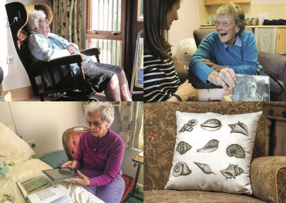

<nav aria-label="...">
  <ul class="pager">
    <li class="previous"><a href="14.html">&larr; Previous</a></li>
    <li class="next"><a href="16.html">Next &rarr;</a></li>
  </ul>
</nav>

---

## Tangible Memories: Community In Care
*Tangible Memories*
 
 
 
### Co-designing digital tools
The Tangible Memories research project has been working to co-design a set of new digital tools to address some of the key societal challenges concerning the care and wellbeing of older people and the legacy of the memories and stories that they leave for future generations.
Bringing together an interdisciplinary team, including digital artists and makers, learning researchers, computer scientists, historians, older people and their carers and families, we are co-designing tangible technologies to enhance democratic community building and to engage residents in care homes in multisensory experiences.

### What have we made?
Our research and co-design work has produced a range of technological prototypes including:
- An app that enables residents to work with families and care staff to create their own interactive life history books or group history books. Stories are recorded into the book and played back by simply scanning pages of the book.
- An interactive rocking chair that enables residents to listen to audio including sounds of nature, poems and favourite music.
- A tactile patchwork cushion which can be programmed to play favourite music or audio stories – personalized for individual residents, using printed images and visual recognition software.
- TopoTiles, miniature geographical landscapes that unlock audio field recordings of places and spaces.
- A ‘pick up to play’ music app, that makes listening to a memory filled music playlist as simple as picking up the phone.
- The use of Virtual Reality headsets that can transport residents to local landmarks and places they are no longer able to visit.

### Collaboration and Engagement
We have found that harnessing the power of innovative tangible technologies in care settings can impact directly on relationships of care, on intra-generational relationships between residents themselves and on intergenerational relationships between residents and their families and friends.

The 3 care homes in which we have worked (one extra care facility, one dementia care facility and one private care home with mixed residents) have seen the effects of the use of these technologies first hand and all are keen to take on our technologies and develop their use in their settings.

At the end of the current funding each of the settings will be provided with a suite of prototype technologies and key members of care staff, some families and several volunteers will have been trained to use the technologies in the care facilities. These technologies will be housed in a designated space within the care homes.

### The Interactive Rocking Chair
With care staff and residents in a care home for people with more advanced dementia we have developed a rocking chair that plays therapeutic sounds from nature, music and poetry, emitted through speakers in the chair’s headrests, and activated by the rocking motion. As the residents gently rock and listen to the dawn chorus, or to crickets singing on a summer’s evening, their journeys of the imagination can rekindle past memories and help to assist story sharing.

Residents’ reactions to our prototype chair were varied and left lasting impressions on all involved. One resident, a former pilot, spent some time exploring the surface of the chair through touch, commenting that it reminded her of the cockpit of an aeroplane. Then, listening carefully to the different sounds emitting from the speakers embedded in the rocking chair’s headrests, she identified a woodpecker and an owl’s call among the chorus of birdsong, and she even cooed back to the owl in reply. As she heard the rhythmic sound of someone walking on snow, she lifted her legs up and down in time, keeping apace with them, and describing a vivid story to us about what was happening in her imagination: ‘The farmer’s on his way’. Another resident, who usually doesn’t speak or sing, sat in the chair and sang ‘Rock a Bye baby’ from beginning to end, causing an emotional response from the care staff present.

### The Story Creator App (Available on iTunes)
Books provide a tangible, familiar interface for storytelling and reminiscence. We have co-designed an app with older people and care staff that can enable them to easily produce books based on their stories. You can create pages that combine a photo, text and an audio recording. These can be viewed within the app or printed out. When printed, the audio recording is represented by
a beautiful shell illustration. The scan function within the app recognizes the shell on each printed page and, as if by magic, plays back your audio.

Rather than making a book about his life and memories, one gentleman we worked with created a book about the extra care facility where he lives. With so many terrible stories of cruelty and neglect in care homes he wanted to document and celebrate the place where he lives.
In the interactive book he talks about his impressions of how the care of older people has changed over the decades. He wanted to include other voices in the book – showcasing the creativity and life histories of other residents, featuring poetry, short stories and accounts from the rich lives they live now and have lived in the past.

### Where next? Continued collaboration and engagement
Our partners in care homes and extra care facilities have told us that they would be keen to create an engaging space in their setting where older people and others can interact with disparate objects, sparking questions and new interests encouraging them to use our technologies together to record and share their ideas, memories and stories. We have worked with them to imagine and design a new space of discovery, connection, meaning making and mystery, filled with objects – rather like the ‘cabinets of curiosity’ or ‘wonder rooms’ of old. Care managers believe there is huge potential to use these Parlours of Wonder as ‘community hubs’ where children from local schools, community groups and isolated older people living in the community might be encouraged to come and enjoy a cup of tea and a chat or a more formal encounter, sparking questions, connections, new interests or opportunities for retreat and contemplation.

Unlike cabinets of curiosity our ‘Parlours of Wonder’ will not be designed and curated by us as historians, learning researchers and artists. Rather we want to disrupt power differentials in regard to who is permitted to order knowledge, rank and classify objects and stories. Our vision is that these spaces will be co-curated by and for residents, care staff, families and community members. We are currently exploring funding routes to support our continued work on these ideas and to develop our prototypes to be of use more widely.

_**Project team:**_

*University of Bristol: Dr Pete Bennett, Dr Kirsten Cater, Professor Tim Cole, Dr Seana Kozar, Dr Helen Manchester*

_**Designers:** Stand + Stare Collective, Heidi Hinder_

_**Collaborators:** Alive! Activities, residents and staff at The Orchards (St Monica’s Trust), Blaise Weston Court (Hanover extra care estate), Stokeleigh Lodge_

---

<nav aria-label="...">
  <ul class="pager">
    <li class="previous"><a href="14.html">&larr; Previous</a></li>
    <li class="next"><a href="16.html">Next &rarr;</a></li>
  </ul>
</nav>
