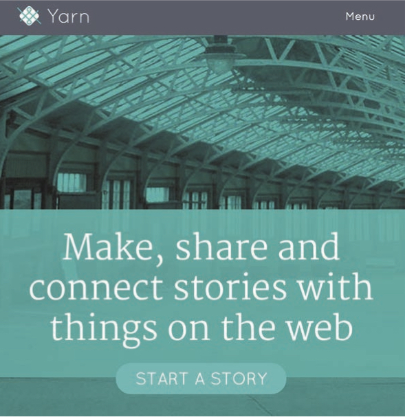

<nav aria-label="...">
  <ul class="pager">
    <li class="previous"><a href="15.html">&larr; Previous</a></li>
    <li class="next"><a href="17.html">Next &rarr;</a></li>
  </ul>
</nav>

---

## Tell A Story On YARN
*Pararchive*
 
 
 
The Pararchive project, based at the School of Media and Communication at the University of Leeds, worked with a diverse range of communities to design and build a digital platform that would allow them to tell stories, present their own histories, do research and work collaboratively. We aimed to co-design and build a range of digital resources that could enable communities to become expert in telling of their own stories, in communicating their own histories, and sharing knowledge. We also wanted them to be able to draw on a broad range of archival and cultural materials to facilitate this work.

Our groups were comprised of archaeologists and local historians from the Isle of Bute in Scotland, Filmmakers and Arduino programmers from Manchester, and industrial historians, ceramics collectors and ecologists from Stoke- on-Trent. They worked in partnership with academics from Leeds and York University, technology developers from Carbon Imagineering and curators, archivists and technology developers from the Science Museum Group and the BBC to create a new digital resource.

Communities and cultural organisations experience many obstacles in using online heritage resources and developing collaborative relationships. Issues of access, copyright and the restrictions often placed on usage are compounded by existing problems of web usability and the dispersed nature of existing resources and platforms. We want to encourage the direct use of digital archives in creative work and historical research, while at the same time breaking down the barriers between institutional collections and the publics they serve.

Using co-design methods, in conjunction with innovative storytelling workshops and creative technology labs, we explored the ways in which our community partners told stories, researched, and engaged creatively. We began through analogue processes, using post-it notes and archival materials to model potential digital resources, and our team from Carbon Imagineering ran design and storytelling workshops in the communities to co-develop a specification and run a series of exercises in which our communities developed their own research agendas and creative projects. Each community ran a series of projects that were then used to develop and test the resource we were creating and through which they would eventually be published. Over the course of the eighteen-month project we created a series of tools that were designed to be intuitive and flexible, aiding users to develop projects that incorporated online materials and allowing them to add their own materials in the form of photographs, films, text and sound recordings. We wanted to orchestrate existing web functions and innovate new tools that would allow people to work on a single site and draw together disparate and unconnected bodies of content. We also wanted to create a space in which every member could create and curate their own collections of materials, and where institutions like galleries and museums could post collections for public use.

Once the communities had determined what they wanted to explore we then engaged a range of institutional partners, most notably the Science Museum Group and BBC Archives, to begin to provide content and materials to form the basis of these projects and allowed these institutions to explore their own relationships with communities and consider ways in which their content could be published and enhanced through crowdsourcing and public expertise.

The project resulted in the creation of the new storytelling tool YARN that has just been launched and offers a series of insights into co-creation approaches, the role of institutional voice, concepts of democratisation of institutional culture, and the changing conceptualisation of the audience, creative interventions and the role of the digital public space. YARN is a resource that can be used
by citizens, communities, organisations and researchers and now we want everyone to help populate and develop our community.

Our resource is open, cost free and relies on hot links to allow for flexibility and avoid frustrating IP issues. It also means that people retain control of their own content and can enrich and give meaning to material, both private and public, that is featured here.

*Learn how to start a story <a href="http://beta.pararchive.com/stories/120">here</a>*

---
<nav aria-label="...">
  <ul class="pager">
    <li class="previous"><a href="15.html">&larr; Previous</a></li>
    <li class="next"><a href="17.html">Next &rarr;</a></li>
  </ul>
</nav>
