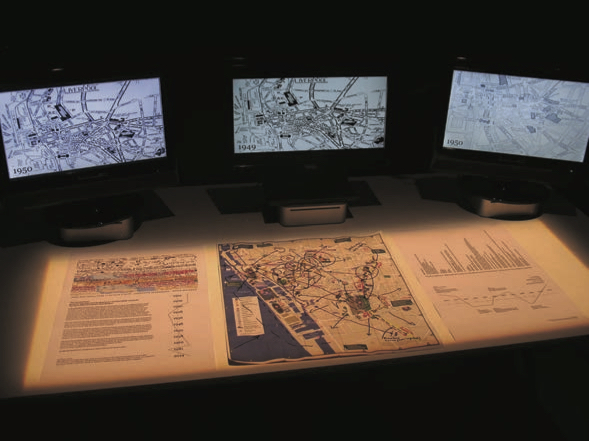

## The Latin(o) American Digital Art Project
*Brian Mackern and Claire Taylor*
 
 
 
The Latin(o) American Digital Art Project from the University of Liverpool explores how artists from Latin America, and those of Latina/o origin in the US, interrogate national and regional identity through the representation of iconic locales in their online art works. The project has focussed on the transformations that digital technologies have on conventional artistic practice, and has looked at how artists create new, hybrid genres as they work with digital technology.

The project has looked at several key issues when dealing with the exhibition and curation of this type of art. Firstly, the various artworks, interventions and events that were organized by the project each relate to the cityspace, and invite the audience to re-think the urban space that surrounds them. The artworks aim to explore how virtual space and physical space can dialogue with each other in the city. This then gives rise to some concerns: firstly, how can digital art – often containing components that exist in virtual space – be exhibited in physical space? Secondly, given that the artworks chosen were originally developed in a specific city space, a fundamental challenge was how to translate that to another city. When taken out of their immediate environment, how do place-based digital artworks function?

The project concluded that, as regards exhibition spaces for new media arts, the venues selected needed to be flexible, and able to accommodate both the digital and the place-based elements of the art works. The exhibiting of the works in a physical place meant that audience interaction could take multiple forms, including the tactile as well as the virtual. Also, adapting the artworks and the associated events to the local circumstances of the space led to creative dialogues with the artists, and a richer understanding of the artworks.

Secondly, the project looked at how to bridge the gap between social media and cultural-artistic practice. Social media use is ever more prevalent in our current times, with an estimated over 2 billion users worldwide. But social media is often used to communicate fleeting thoughts, or mundane comments about everyday activities. How might we capitalize on the current boom in social media to, instead, encourage audiences to engage with artworks? How can critical thinking and artistic engagement be mobilized via social media? And how might we conceive of social media as a way to develop feedback loops with artworks, and to help the artworks reach out beyond the gallery space?

Here, the project developed Twitter curation activities, focussed around two months of Twitter galleries, and found that this enabled an engagement that was less cumbersome than the traditional ‘exit survey’, and was also a way of making the artwork more dynamic. Challenges included being able to develop a narrative through the limited character lengths of Twitter, and of effecting real changes in behaviour when people use Twitter – more on which can be seen in our Policy Document.

Thirdly, the project looked at how to ensure the representation of Latin American and Latina/o American artists within the digital art scene. Often, discourse about new media technologies is predominantly Anglophone: it’s frequently the latest technologies developed in the US that grab the headlines, and much of what is written about technology tends to be focussed on English- language works. All too readily, when we think of ‘technological innovation’, we implicitly assume a broadly US model as the norm. But what about the vast community of non-Anglophone artists working with digital technologies? Major developments in digital practice, such as the resistant use of low-tech, or tactical media, have their roots in, or have been elaborated by, Latin(a/o) Americans. These approaches have had major impacts on digital artistic practice, and can make significant contributions to our understandings of how digital technologies and art can come together.

Hence the project attempted to raise the profile of Latin American digital artists, bring their work to a UK audience, and provide for innovative forms of engagement with their practice. This involved close collaboration with, and support from, the curators at FACT, Liverpool, and at the Independents Liverpool Biennial. There were significant benefits, including an enrichment of the current offering, and the bringing into dialogue of different practices. There were also challenges, including linguistic and cultural ones, which are discussed at more length in our Policy Document.

### At the Digital Design Weekend
At the Digital Design Weekend, The Latin(o) American Digital Art Project presents *This Too Shall Pass// Affective Cartographies*, the multimedia art work developed by their Artist in Residence, Brian Mackern, during his residency in Liverpool in 2014. This Too Shall Pass was developed during the Cities in Dialogue series of interventions, which brought together leading digital artists from across Latin America who each engage with cityscapes. The intervention includes a showing of the artwork This Too Shall Pass across multiple screens, with sound and interactive features for audience intervention. For this artwork, Brian reworked the footage obtained through his dérives (a series of unplanned journeys along an urbanscape) in Liverpool. That gathering of information and recording of sound and visual material is then remixed in this artwork by different parameters (volume levels, transparencies, zooms, fragmentations, crossfadings, speeds of timelines, etc.) controlled by Liverpool’s ‘socio economic historic curve’ of the last century.

In this piece, Brian Mackern addresses the representation of places and different aspects of the localization of ‘being’. He also engages with the port city: ports are waypoints on a trip, ingesting and refashioning cultures, rebuilding urban traces and histories. Ports construct societies and are ways of reinserting new and old meanings into our ways of seeing and being in the world; they provide opportunities for an outsider stuck inside another culture to question his being in this world. They are, in other words, interfaces.

As well as the digital artwork itself, printed postcards are also provided as part of the installation, and form a way of continuing the dialogues across the cities. The public is encouraged to take away one of the postcards and send it to another city, or to post it into our low-tech postbox to provide feedback on the project and communicate with the artist.

There is also the opportunity to vote for images, and share your own images of your own city, using Twitter, through the project’s Twitter galleries. There will be the opportunity to share in the debate on Twitter curation. Finally, the project will also be sharing their Policy Document, which arises from the findings of the project.
