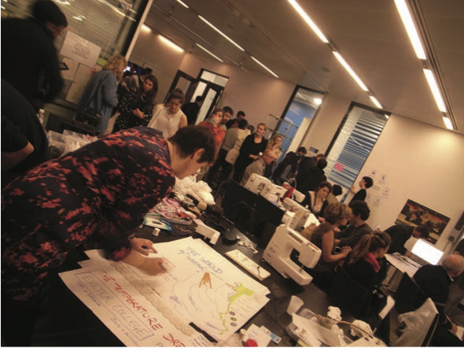

<nav aria-label="...">
  <ul class="pager">
    <li class="previous"><a href="19.html">&larr; Previous</a></li>
    <li class="next"><a href="21.html">Next &rarr;</a></li>
  </ul>
</nav>

---

## Met Office Informatics Lab
*Digital Design Weekend Hack*
 
 
 
2015 will be my third year at the V&A Digital Design Weekend; these events have had a remarkable impact on how my colleagues and I think about our work, and our way of working. This year I’ll be participating as part of the newly formed Met Office Informatics Team, a group born of a commitment to experiment publicly with the use of new technology and design. Back in 2011 when I introduced the Met Office to hackathons our events were quite private affairs, in September 2013 that suddenly changed. Being invited to work in a major museum, meant I needed to find creative collaborators who were enthused by the idea of making in public. With no real track record, and only a vague notion of what we might achieve, it required brave makers. Exeter College came to the rescue and dazzled us all. For the Climate Change and Fashion Hackathon in 2013 we set ourselves the challenge of breaking free from the typical constraints of a hackathon and making wearable items in two days. Gently directed by their tutors Michelle Moinzadeh, Julie Saunders and Rupert Johnstone, the Exeter College students embraced the challenges and got on with making stuff. This experience has affected how all of us think about our own learning. I’ll let Michelle Moinzadeh explain:

My students are intelligent, creative but above all skilful and they love to make. They don’t just want to make a dress or a pair of trousers, and our conversation normally starts with, ‘Michelle, I have an idea for my outcome, I want to MAKE .....’

When Michael asked me, my students and my colleague Rupert Johnstone to join them in a ‘hackathon’ at the V&A three years ago, we jumped at
the opportunity not really knowing what a ‘hackathon’ was. Michael tried desperately to explain how this might work and then simply said ‘we just go to the London Design Festival and MAKE STUFF and have fun, with lots of other people who want to make stuff’. My students at that point jumped at the opportunity to ‘Make Stuff’ and the prospect of working with scientists, coders, fashion designers, product designers and other makers was just all they could talk about.

Back at Exeter College, full of enthusiasm for the idea and its potential, we tried to explain the concept of the ‘Hackathon’ and the benefits of the process to our colleagues and managers. Whilst sensing our excitement, they also sensed the inevitable ‘looseness’ of an open-ended process such as this and reminded us of the necessity of keeping the focus on teaching and learning.

Rupert and I then had to think about how we were going to build this new way of collaborative thinking and teaching into our everyday working practice and curriculum. How do you get young learners to feel confident about openly sharing ideas in the classroom and at a prestigious event such as the London Design Festival with existing designers, highly inventive scientists and makers?

This was easier than we realised; our students unlike ourselves, and any generation before, have grown up within an ever changing digital world, where new ideas and technology are openly shared every minute of the day. The idea of sharing information and the respect that they all have for sharing ideas and information is inspiring. As young individuals they are interested in their world and are well informed about issues which are relevant now and in their futures. They respect one another’s viewpoints and are always supportive of each other’s ideas and thoughts.

The importance of ‘hack’ events is that they give learners of all ages and abilities the opportunity to work collaboratively, exploring and inventing ideas to produce a solution without the fear of failing an assessment or an exam. Working collaboratively with a diverse group of individuals often means experimenting with each other’s ideas and skills, learning from each other, and often pushing the boundaries of what, for them, they would have imagined possible. The process of making an outcome or resolving a challenge collaboratively teaches them more about the processes of how to think creatively. The chance to work with specialists in other disciplines helps our students to see the problem from other viewpoints, using methodologies possibly unfamiliar to their own and widening their knowledge and understanding of differing approaches. Furthermore, they can see how their own skills in making and thinking creatively are valued by respected professionals in a number of different fields, an important affirmation of the validity of their chosen career path.

That thinking process can be brought back into the classroom and used in all their learning activities. Students who have participated in ‘hacks’ or ‘challenges’ often get so absorbed in their activity that they forget about time and learning becomes fun and real. Many of our students progress onto higher education and are able to take these valuable skills with them and become lifelong learners. For every learner this has been one of the highlights of their learning experience at Exeter.

The #FashionClimate hackathon at the Digital Design Weekend at the V&A in 2013 was our entrée into this new world. Our learners had the opportunity to work with fashion designer Professor Helen Storey on her Climate Dress project. The aim was to raise awareness of climate change and its implications for the fashion industry and what it can do to lessen the impact of its activities on the global climate. The project is still ongoing and we continue to work on these ideas with our students.

Seeing how much we enjoyed the V&A hack, Michael suggested another event that we might like to take part in. The International Space Apps Challenge, organised by NASA, takes place over a weekend in sixty five countries with over eight thousand participants, a truly global collaboration.

So in April 2014, Exeter College students, collaborating with Jon Spooner of UNSA and Professor Jon Rogers of Dundee University, designed and prototyped internet connected clothing for astronauts on the International Space Station. To the delight of our students this project won one of the five global awards.

Following this, we saw an opportunity to take the excitement of hackathons and the Digital Design Weekend into a new event in Exeter. There is a wide pool of amazing skills and talent in science, technology and the arts in the South West. Our aim in organising ‘Connected Exeter’ is to try to bring some of this talent together with some of the amazing things we had seen in London. Added to this, to include students of all specialisms and levels as well as the public for a weekend of collaboration, learning and fun. The first festival in 2014 was organised in partnership with Exeter College, the Met Office, the Royal Albert Memorial Museum, The Phoenix Arts Centre and the Fab Lab at Exeter Central Library, with help and support from Irini Papadimitriou of the V&A.

Our aim is to introduce this amazing learning experience to a wider range of students across Exeter College and beyond. The London Digital Festival enables us to showcase our work and to continue to integrate the opportunities afforded by the collaborations that this partnership with the Met Office has enabled. We want to expand and embed this creative process further within our curriculum and other teaching institutions so more young individuals can continue being involved in collaborations and digital making. It offers exciting opportunities to make the process of learning more relevant to the working world that our students will enter and makes what has already been taught in the classroom more valid and real as it is ‘discovered’ and thus aids the development of learning skills. Lastly and most importantly, because it is fun of course!

_**Met Office Informatics Lab:** Michael Saunby
**Exeter College:** Michelle Moinzadeh, Rupert Johnstone and Thomas Duggan_

---

<nav aria-label="...">
  <ul class="pager">
    <li class="previous"><a href="19.html">&larr; Previous</a></li>
    <li class="next"><a href="21.html">Next &rarr;</a></li>
  </ul>
</nav>
