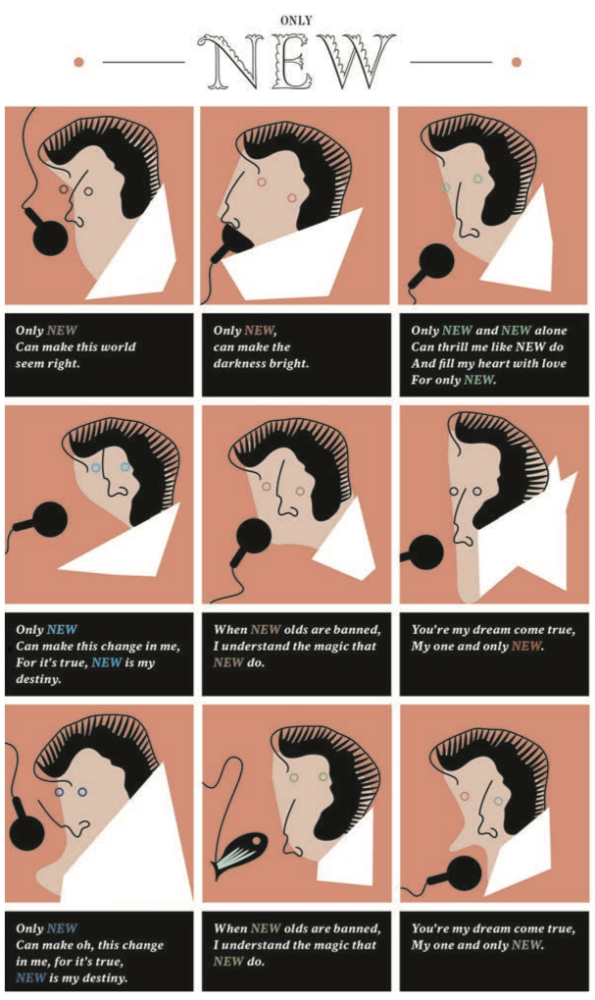
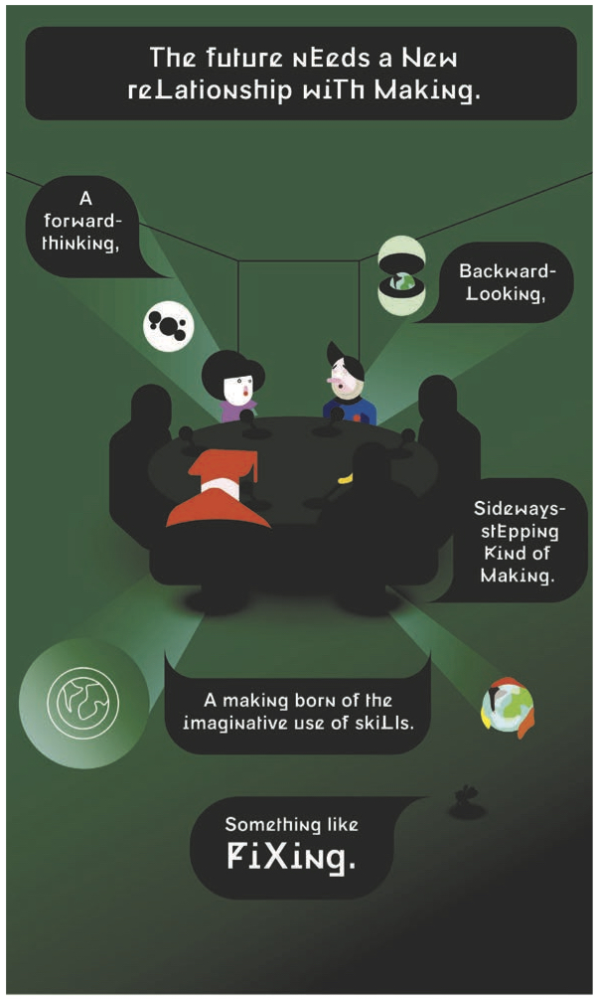
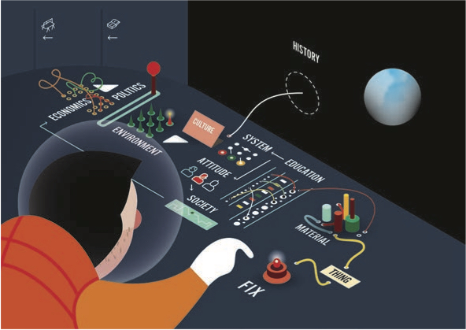

<nav aria-label="...">
  <ul class="pager">
    <li class="previous"><a href="20.html">&larr; Previous</a></li>
    <li class="next"><a href="22.html">Next &rarr;</a></li>
  </ul>
</nav>

---

## #fixingattitudes
**
 
 
 
Fixperts is an active and growing creative social platform that encourages people who are good at making to fix for others and share their stories online. Founded in 2012 by designers Daniel Charny, James Carrigan and a group of like-minded volunteers, it is now happening in universities and schools as well as within commercial companies in over 15 countries.

Fixing is not in any way new and is still often the most immediate and efficient thing to do when things stop working. However, a growing part of urban populations are becoming estranged from the knowledge of repair, which leaves them with the limited options of either replacing or ignoring. Is it because we are wired to desire the new? And are we past the point where abilities to make and think like makers will shape our future? Can we afford to lose humanity’s most precious resource or should we find a way to fix this?

Collaborating with designer Koby Barhad, Charny edited a comics titled Brave Fixed World. The excerpts included here are staged in three chapters, from reflecting on attitudes to calling for a more resilient, conscientious, generous and creative future.

**Chapter 1: Only New**
_There is no need to know how to make or fix things. Endless resources mean new is the only way forward. New is the new black. Use once. Worship disposability. Throw away culture. Keeping is for losers. Only new and new alone can make this world seem right._

**Chapter 2: Wake Up**
_No one knows how to make or fix things. Scarce resources mean resilience is the only way forward. Humanity wakes up to its most precious resource: imaginative use of skills. A new type of making is the only way backwards, sideways and forward._

**Chapter 3: Where do we start?**
_Making and thinking. Examples and principles. Actions and words. Whether it’s about fixing things or processes, materials or systems, society or economics... we need to start with #fixingattitudes._

*Chapter 1*

*Chapter 2*

*Chapter 3*

---

<nav aria-label="...">
  <ul class="pager">
    <li class="previous"><a href="20.html">&larr; Previous</a></li>
    <li class="next"><a href="22.html">Next &rarr;</a></li>
  </ul>
</nav>
