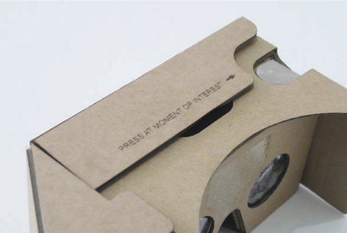
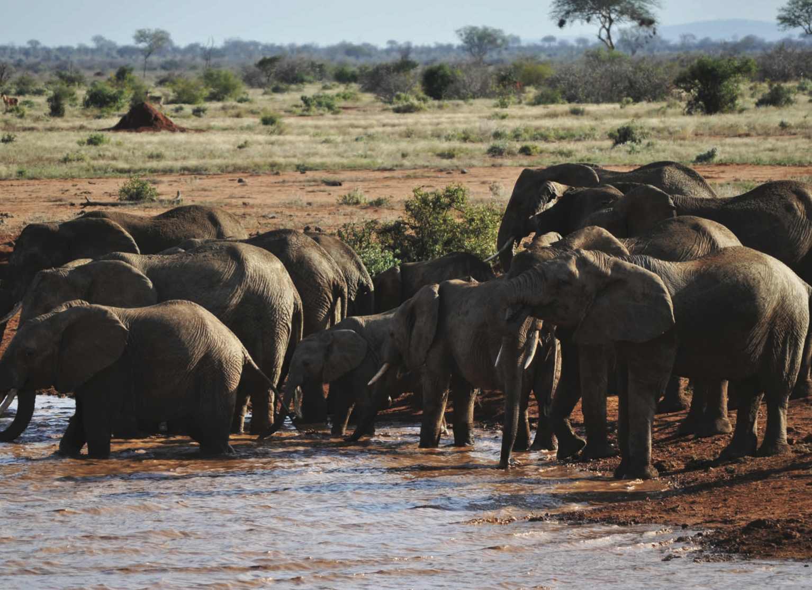
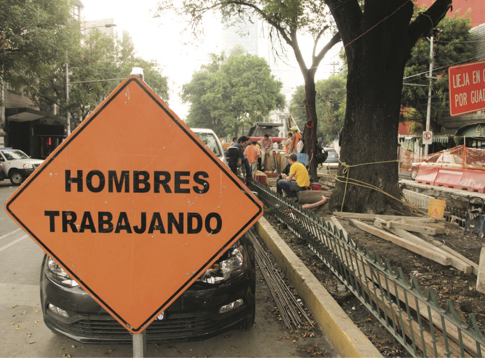

<nav aria-label="...">
  <ul class="pager">
    <li class="previous"><a href="25.html">&larr; Previous</a></li>
    <li class="next"><a href="27.html">Next &rarr;</a></li>
  </ul>
</nav>

---

## Seven Seconds Ago
**
 
 
 

*Digital innovation needs to come from researching the wild: Elephants in Tsavo West National Park, Kenya.*

Britain has a very personal and domestic relationship with it’s wildlife. From our national pastime of feeding the bird table (damn those squirrels), to citizen science with BBC’s Spring Watch, to listening to urban foxes reclaim the streets (and bins) in the midnight hours. The thing is, we like to be close to nature. And it’s big business. In the UK, according to the British Ornithological society this is estimated at £200 million annually. This connection to just the birds in our garden is incredible. It’s a formative part of our youth, a thing
we do as soon as we have our first home and a thing we might do with our children and grandchildren, bringing live feeds (excuse the pun...) to our gardens and backyards through our windows.

So in crafting our digital futures for connecting to wildlife we wanted to think about how can we blend the physical world in order to create and curate new viewing experiences tailored to what we want. Watching a birdfeeder on YouTube (view hits 140K – and has a cat in it) has nowhere near the appeal of watching cats (if you’re called Maru – 240M). But does digital really represent our physical world? I am sure that the views from global windows on birdfeeders would be in the billions. Illustrating that while you might not capture data in the real world, it’s significance far outweighs digital.

Starting with the physical versus virtual viewing experience of birdfeeders from our homes, we wanted to think about how we can provide highly compelling, possibly magical viewing experiences of animals in far off places. Animals that we need to protect. Animals that are under threat from poachers, their changing environment and the impact of the growing human population.

Conservation has never been more important. We don’t need to tell you this, but it doesn’t help to be reminded every now and again! The way we connect to conservation in far off places is a priority concern for conservation and wildlife agencies globally as we know that what might happen to visitors to watering holes in Kenya, icebergs in the Antarctic or a carcass in the jungles of Bangladesh will in some form or another come to visit us in the not so far off future.

Digital camera and viewing technology is in a remarkable place right now – with lots of unexpected innovations changing how we capture and look at moving and still images. Google Cardboard (an open-source low-cost cardboard 3D viewer) is one of these innovations. The experience is staggeringly effective. If you haven’t tried it, you should, as it illustrates that digital innovation doesn’t have to come from silicon and (maybe shiny) plastic. Camera technology is also undergoing some interesting changes. We know that Kodak Moments are something of the past, but the playfulness of GoPro has been leapt upon by our growing Generation Z population.

With further simple physical innovations in camera tech, like the fisheye lense on GoPro, it’s possible to completely change its appeal. Similarly a single camera pointed at a near perfect cone-shaped mirror can, with a little digital re-mixing, capture a 360°view using a standard lens. Oh and all of these cameras can now continuously stream via Wifi, 3-4G and Bluetooth – giving you a feed in any form anywhere in the world. A feed that isn’t just for Gen Z’s capturing their lives, but for everyone wanting to digitally connected to anything.
In Seven Seconds we wanted to harness this crafted digital viewing technology to find new ways to go about digital conservation. Playing on the notion that we want to make people closer to endangered animals (digitally!) we have built a viewing system that gives a live 360 viewing experience from anywhere in the world that you can connect to the web.

We want to expand how people are actively involved in digital conservation by capturing live (or as near as) footage and monitor wildlife activity. By streaming the content to citizen scientists – to people wanting to experience the thrill of watching eloquent giraffes stumble past, families of elephants shake the ground and inquisitive meerkats watching for approaching eagles – we want to make a difference through a unique data capture process. We’ve added a social feedback element to the device that enables viewers to confirm what they are seeing. Tap the button when you see a species. Look up for your identification list. Think you know what it is? Look down for the key facts. Make your choice. You will be helping to count, monitor and conserve wildlife. You’re a citizen scientist – thousands of miles away – able to observe fascinating wildlife interactions and, encounters through innovative new technologies. You might be 5 or 85. You might speak Gujarati, Bantu Swahili or French...  
It doesn’t matter. What does matter is that you are able to connect to far off animals that need your help now. And while this work is just off the shelf, we hope it will find new ways to open up open source hardware and software for global digital conservation.

_**Project Team:** Tim Brooke, Jack Chalkley, Ade Cockle, Alasdair Davies, Jon Rogers_

*Lunchbreak in Mexico City during UKMX.*

---

<nav aria-label="...">
  <ul class="pager">
    <li class="previous"><a href="25.html">&larr; Previous</a></li>
    <li class="next"><a href="27.html">Next &rarr;</a></li>
  </ul>
</nav>
